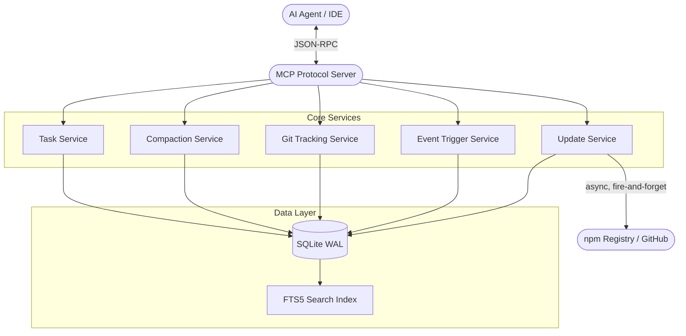

<div align="center">

# 🧠 Engram

> **Persistent Memory Cortex for AI coding agents. Gives agents session continuity, change tracking, and decision logging across sessions.**


</div>

---

## 📋 Table of Contents
- [Overview](#overview)
- [Why Engram?](#why-engram)
- [Installation (Auto & Manual)](#installation)
- [✨ What's New in v1.4.1](#-whats-new-in-v141)
- [Features](#features)
- [Architecture](#architecture)
- [Tools Reference](#tools-reference)
- [Using with AI Agents](#using-with-ai-agents)
- [Contributing](#contributing)
- [License](#license)

---

## Overview

**Engram** is an [MCP (Model Context Protocol)](https://modelcontextprotocol.io) server that gives AI coding agents persistent memory across sessions. Instead of re-reading files, re-discovering architecture, and re-learning conventions every time a session starts, the agent calls `engram_start_session` and instantly receives everything it needs.

It operates seamlessly as a background brain for popular AI tools like **Claude Code**, **Claude Desktop**, **Cursor**, **Windsurf**, **Cline**, **Trae IDE**, and **GitHub Copilot** (VS Code & Visual Studio).

---

## Why Engram?

Every AI coding agent is **stateless by default**. Each new session starts from scratch:
- The agent re-reads file structures and re-discovers architecture.
- Architectural decisions made in previous sessions are forgotten.
- Conventions agreed upon are lost.
- Work-in-progress tasks have no continuity.
- **Time, tokens, and patience are wasted on repeated discovery.**

Engram solves this by providing a **persistent brain** using a native SQLite (WAL mode) database. An AI agent should only need to deeply review a file once. When you ask it to change something, it should already know where to go.

---

## ✨ What's New in v1.4.1

**v1.4.1** is a targeted hotfix that resolves a series of critical and high-severity bugs discovered during a full audit of the installer infrastructure — verified against official documentation for every supported IDE.

- **macOS Install Path Fixed (Critical):** `process.env.APPDATA` is Windows-only. On macOS, the fallback resolved to `~/.config` instead of `~/Library/Application Support`, causing VS Code, Cline, and Claude Desktop installs to silently write to the wrong directory. The IDE never read from it, yet re-runs reported "Already installed." The `APPDATA` constant is now OS-aware across all three platforms.
- **Visual Studio Config Key Fixed (Critical):** Visual Studio reads the `"servers"` JSON key, not `"mcpServers"`. Every install wrote to a key VS never reads — Engram was permanently invisible in Visual Studio. Fixed and confirmed against official Microsoft docs.
- **Wrong Secondary Paths Removed (High):** VS Code's `~/.vscode/mcp.json` (the extensions dir), Cursor's `APPDATA/Cursor/mcp.json`, and Windsurf's `APPDATA/Windsurf/mcp.json` were all wrong paths that don't exist on any real machine. Removed in favour of the single correct path for each IDE.
- **Multi-IDE Awareness:** Most developers have multiple IDEs installed simultaneously. The installer now scans all installed IDEs via filesystem and installs to all of them in one pass — without the user needing to run it multiple times with different `--ide` flags.
- **Better IDE Detection:** Cursor detection now checks `CURSOR_TRACE_ID` and `process.execPath` before falling back to fragile PATH matching. Visual Studio is now detected via `VSINSTALLDIR`/`VisualStudioVersion` env vars.
- **`--check` Reference Fixed (High):** `--check` was comparing IDE config versions against the running binary, not npm latest — producing backwards results when running from local source. npm latest is now fetched first and used as the sole reference.
- **CWD Source Conflict Warning:** When `npx` resolves to the local Engram source directory, a clear warning is printed before any output so users understand why the version reported may not match npm.
- **JetBrains Install Warning:** JetBrains MCP config is managed via the IDE Settings UI, not a config file. A warning is now shown during install directing users to `Settings › Tools › AI Assistant › Model Context Protocol`.
- **Claude Code CLI Hint Fixed:** The `claude mcp add-json` hint displayed arguments in the wrong order. Fixed to `claude mcp add-json engram '{...}' --scope user`.

> Previous release: **v1.4.0** — Versioned installs, background auto-update check, `--check` CLI flag, `engram_stats` version info, `engram_config` update keys. [Full notes →](https://github.com/keggan-std/Engram/releases/tag/v1.4.0)

---

## Installation

Engram is published to the npm registry. **You do not need to download or compile any code.** Your IDE will download and run the latest version automatically using `npx`.

### Prerequisites

Engram uses **SQLite** for persistent storage via the `better-sqlite3` library, which includes a native C++ addon. On most systems this is handled automatically via prebuilt binaries. However, if no prebuilt binary matches your platform, npm will attempt to compile from source — which requires:

- **Windows:** [Node.js](https://nodejs.org) (v18+) and [Windows Build Tools](https://github.com/nodejs/node-gyp#on-windows) (Visual C++ Build Tools + Python). Install them with:
  ```bash
  npm install -g windows-build-tools
  ```
  Or install **"Desktop development with C++"** via the [Visual Studio Installer](https://visualstudio.microsoft.com/downloads/).
- **Mac:** Xcode Command Line Tools (`xcode-select --install`)
- **Linux:** `build-essential` and `python3` (`sudo apt install build-essential python3`)

### Option 1: The Magic Installer (Interactive)
Run this single command in your terminal. It will automatically detect your IDE and safely inject the configuration:

```bash
npx -y engram-mcp-server --install
```

**Non-interactive mode (CI/CD / Scripting):**
```bash
npx -y engram-mcp-server install --ide vscode --yes
```

**Clean removal:**
```bash
npx -y engram-mcp-server install --remove --ide claudecode
```

**Check installed version vs npm latest:**
```bash
npx -y engram-mcp-server install --check
```

### Option 2: Global Install (Windows Fallback)

If `npx -y engram-mcp-server --install` fails on Windows, install globally first then run the installer:

```bash
npm install -g engram-mcp-server
engram install --ide <your-ide>
```

> **Note:** During install you may see `npm warn deprecated prebuild-install@7.1.3`. This is a cosmetic warning from a transitive dependency used to download SQLite prebuilt binaries. It does not affect functionality and is safe to ignore.

### Option 3: Manual Configuration

If you prefer to configure manually, find your IDE below:

<details>
<summary><strong>Claude Code (CLI)</strong></summary>

Run this in your terminal:
```bash
claude mcp add-json --scope=user engram '{"type":"stdio","command":"cmd","args":["/c","npx","-y","engram-mcp-server"]}'
```
*(Omit `"command":"cmd"` and `"args":["/c", ...]` on Mac/Linux, use just `"command":"npx"`).*
</details>

<details>
<summary><strong>Claude Desktop</strong></summary>

Add to your `claude_desktop_config.json`:
- **Windows:** `%APPDATA%\Claude\claude_desktop_config.json`
- **Mac:** `~/Library/Application Support/Claude/claude_desktop_config.json`

```json
{
  "mcpServers": {
    "engram": {
      "command": "npx",
      "args": ["-y", "engram-mcp-server"]
    }
  }
}
```
</details>

<details>
<summary><strong>VS Code (GitHub Copilot)</strong></summary>

Create `.vscode/mcp.json` in your project root, or add to your global user `settings.json`:
```json
{
  "servers": {
    "engram": {
      "type": "stdio",
      "command": "npx",
      "args": ["-y", "engram-mcp-server"]
    }
  }
}
```
</details>

<details>
<summary><strong>Cursor & Windsurf</strong></summary>

For Cursor, edit `~/.cursor/mcp.json`. For Windsurf, edit `~/.codeium/windsurf/mcp_config.json`:
```json
{
  "mcpServers": {
    "engram": {
      "command": "npx",
      "args": ["-y", "engram-mcp-server"]
    }
  }
}
```
</details>

<details>
<summary><strong>Visual Studio 2022/2026</strong></summary>

Create `.vs/mcp.json` in your solution root:
```json
{
  "mcpServers": {
    "engram": {
      "command": "npx",
      "args": ["-y", "engram-mcp-server"]
    }
  }
}
```
</details>

<details>
<summary><strong>Trae IDE</strong></summary>

For Trae IDE, edit `.trae/mcp.json` in your project root:
```json
{
  "mcpServers": {
    "engram": {
      "type": "stdio",
      "command": "npx",
      "args": ["-y", "engram-mcp-server"]
    }
  }
}
```
</details>

<details>
<summary><strong>JetBrains (Copilot Plugin)</strong></summary>

Edit `~/.config/github-copilot/intellij/mcp.json` or use the built-in Settings → MCP Server:
```json
{
  "mcpServers": {
    "engram": {
      "command": "npx",
      "args": ["-y", "engram-mcp-server"]
    }
  }
}
```
</details>

<details>
<summary><strong>Cline / Roo Code</strong></summary>

In the extension settings → MCP Servers:
```json
{
  "mcpServers": {
    "engram": {
      "command": "npx",
      "args": ["-y", "engram-mcp-server"]
    }
  }
}
```
</details>

---

## Features

- 🧠 **Session Continuity:** Each session automatically receives the previous session's summary, changes, decision, and full project context.
- ⏰ **Scheduled Events:** You can tell Engram to postpone tasks or remind you of things. Triggers include `next_session`, `datetime`, or `task_complete`.
- 📝 **Change Tracking:** Records every file modification with context. Combines agent-recorded changes with `git` history. You can also set up Git hooks to auto-commit logs directly into Engram.
- 🏗️ **Architectural Decision Records:** Logs design decisions with rationale, affected files, and tags forever.
- 📁 **File Intelligence:** Stores per-file notes (purpose, deps, layer, complexity) preventing endless re-reads.
- 📐 **Convention Tracking:** Records and enforces project conventions (naming, testing, styling).
- ✅ **Task Management:** Work items persist across sessions. Ask the agent to create a task for what's pending when you end a session.
- 🔍 **Precise Full-Text Search (FTS5):** High-performance ranked search across all memory, with precise tag filtering using `json_each()`.
- 💾 **Backup & Restore:** `engram_backup` creates timestamped SQLite copies to any path (like Dropbox/OneDrive) for seamless cross-machine portability.

---

## Architecture



---

## Tools Reference

Engram exposes 30+ tools. Here are the core highlights of what an agent can do for you:

### Core Memory Tools
| Tool | Purpose |
|------|---------|
| `engram_start_session` | Begin a session, getting full context from previous work. |
| `engram_end_session` | End session, providing a summary for the next time. |
| `engram_record_change` | Record file changes with descriptions. |
| `engram_set_file_notes` | Store intelligence about a file's purpose and complexity. |
| `engram_record_decision` | Log an architectural decision and its rationale. |

### Tasks & Scheduling
| Tool | Purpose |
|------|---------|
| `engram_create_task` | Create a persistent work item between sessions. |
| `engram_schedule_event` | Schedule deferred work with a trigger (`next_session`, `datetime`, etc). |
| `engram_check_events` | Mid-session check for triggered events that require attention. |

### Utilities
| Tool | Purpose |
|------|---------|
| `engram_search` | FTS5-powered full-text search across all memories. |
| `engram_scan_project` | Scan and cache project structure automatically. |
| `engram_backup` | Create a database backup to any synced folder. |
| `engram_config` | Read or update runtime configuration values. |
| `engram_health` | Run database health checks and report diagnostics. |

*(Run the agent and ask to list available tools for the complete reference).*

---

## Using with AI Agents

Add the following to your agent's system prompt or custom instructions — Cursor Rules, `.github/copilot-instructions.md`, `CLAUDE.md`, or whichever file your IDE reads. The goal is to make the agent consult Engram **before** doing work, not just after. That's where most of the token and time savings come from.

> You have access to **Engram**, a persistent memory MCP server. It stores everything learned about this project across all sessions: file notes, architectural decisions, conventions, tasks, and change history. Use it to avoid re-reading files already analysed, re-debating settled decisions, and re-discovering known context.

---

### 🟢 Session Start

**Always call `engram_start_session` first** — before reading any file or taking any action. Act on everything it returns:

| Field | What to do |
|-------|-----------|
| `previous_session.summary` | Read immediately. Do not re-explore what is already known. |
| `active_decisions` | Binding. Follow them; do not re-debate. To change one, supersede it with a new `engram_record_decision` call. |
| `active_conventions` | Enforce in every file you touch this session. |
| `open_tasks` | Pending work items. Ask the user which to focus on if unclear. |
| `update_available` | Tell the user: *"Engram v{available_version} is available (you have {installed_version}). Changes: {changelog}. Update, skip, or postpone?"* — then act on their choice. |

If `update_available` is set, respond to the user's choice:
- **Update** → `npx -y engram-mcp-server install`
- **Skip** → `engram_config action=set key=auto_update_skip_version value={version}`
- **Postpone** → `engram_config action=set key=auto_update_remind_after value=7d`
- **Disable** → `engram_config action=set key=auto_update_check value=false`

---

### 📂 Before Reading Any File

Always check Engram before opening a file:

```js
engram_get_file_notes({ file_paths: ["path/to/file.ts"] })
```

- **Notes exist** → Use stored purpose, dependencies, layer, and complexity. Only open the file if you need the actual source for editing or line-by-line analysis.
- **No notes** → Read the file, then immediately call `engram_set_file_notes` with `file_path`, `purpose`, `dependencies`, `dependents`, `layer`, `complexity`, `notes`. Batch multiple files in one call.
- **Notes stale** → (evidence the file changed significantly — e.g. git log) Re-read and update.

> **Rule:** Never read a file already analysed in a previous session without checking Engram first.

---

### 🏛️ Before Making Any Design Decision

Before choosing an implementation approach, search for an existing decision:

```js
engram_search({ query: "relevant keywords", scope: "decisions" })
```

- **Decision exists** → Follow it.
- **Should change** → Explain why, then supersede:
  ```js
  engram_record_decision({ decision: "...", supersedes: <id> })
  ```
- **No decision exists** → Make the call and record it:
  ```js
  engram_record_decision({ decision, rationale, affected_files, tags })
  ```

---

### ✏️ When Modifying Files

After every meaningful change, record it. Batch where possible:

```js
engram_record_change({ changes: [{
  file_path,
  change_type,   // created | modified | refactored | deleted | renamed | moved | config_changed
  description,   // What changed AND why — not just the action. Future sessions read this.
  impact_scope   // local | module | cross_module | global
}]})
```

---

### 🔍 When You Don't Know Something

Search Engram before asking the user — they may have already explained it to a previous session:

```js
engram_search({ query: "keywords" })          // general search
engram_scan_project()                         // project structure questions
engram_get_decisions()                        // architecture / approach questions
engram_get_conventions()                      // style / pattern questions
engram_get_file_notes({ file_paths: [...] })  // what is known about specific files
```

---

### 🔴 Session End

Before ending every session:

1. Record all file changes not yet recorded (`engram_record_change`).
2. Create tasks for anything incomplete or blocked:
   ```js
   engram_create_task({ title, description, priority })
   ```
3. Call `engram_end_session` with a summary that includes:
   - Exactly what was done — file names, function names, specific changes
   - What is pending or blocked, and why
   - Any new patterns, gotchas, or constraints discovered
   - Which tasks were completed or partially done

A precise summary is what allows the next session to start immediately without re-reading files or re-asking the user for context.

---

## Contributing

We welcome contributions!
1. Fork the repo and create your branch (`git checkout -b feature/amazing-idea`).
2. Install dependencies: `npm install`.
3. Build the project: `npm run build`.
4. Run tests: `npm test` (Uses Vitest).
5. Commit your changes and open a Pull Request.

---

## License

This project is licensed under the [MIT License](LICENSE).

---

<div align="center">
  <em>Because your AI agent shouldn't have amnesia.</em><br/>
  <strong>Copyright &copy; 2026 Keggan Standard - Tanzania</strong>
</div>
