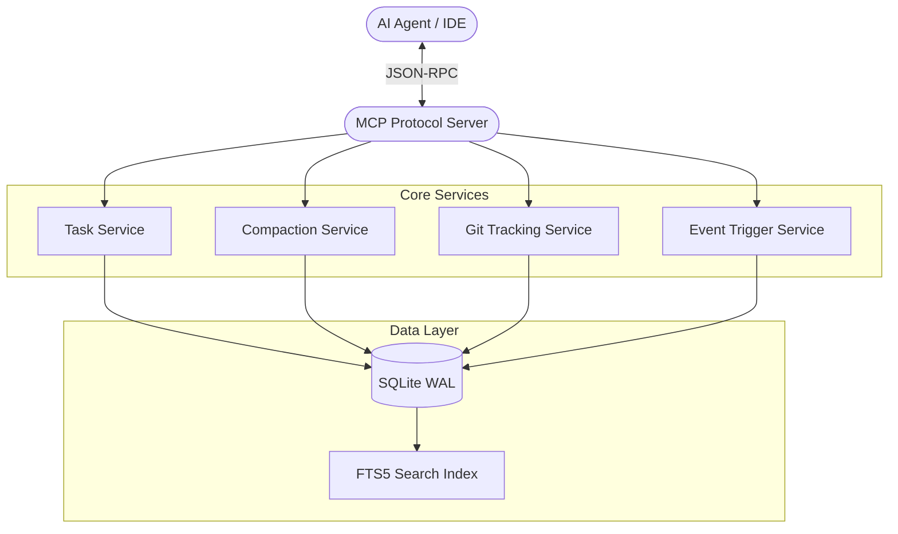

<div align="center">

# 🧠 Engram

> **Persistent Memory Cortex for AI coding agents. Gives agents session continuity, change tracking, and decision logging across sessions.**


</div>

---

## 📋 Table of Contents
- [Overview](#overview)
- [Why Engram?](#why-engram)
- [Installation (Auto & Manual)](#installation)
- [✨ What's New in v1.2.0+](#-whats-new-in-v120)
- [Features](#features)
- [Architecture](#architecture)
- [Tools Reference](#tools-reference)
- [Using with AI Agents](#using-with-ai-agents)
- [Contributing](#contributing)
- [License](#license)

---

## Overview

**Engram** is an [MCP (Model Context Protocol)](https://modelcontextprotocol.io) server that gives AI coding agents persistent memory across sessions. Instead of re-reading files, re-discovering architecture, and re-learning conventions every time a session starts, the agent calls `engram_start_session` and instantly receives everything it needs.

It operates seamlessly as a background brain for popular AI tools like **Claude Code**, **Claude Desktop**, **Cursor**, **Windsurf**, **Cline**, **Trae IDE**, and **GitHub Copilot** (VS Code & Visual Studio).

---

## Why Engram?

Every AI coding agent is **stateless by default**. Each new session starts from scratch:
- The agent re-reads file structures and re-discovers architecture.
- Architectural decisions made in previous sessions are forgotten.
- Conventions agreed upon are lost.
- Work-in-progress tasks have no continuity.
- **Time, tokens, and patience are wasted on repeated discovery.**

Engram solves this by providing a **persistent brain** using a native SQLite (WAL mode) database. An AI agent should only need to deeply review a file once. When you ask it to change something, it should already know where to go.

---

## ✨ What's New in v1.2.0+

- **Universal IDE Installer:** Radically improved `npx` installer supporting 10+ IDEs automatically including Claude Code, VS Code, Visual Studio 2022/2026, Trae IDE, JetBrains, Cursor, and Windsurf.
- **Windows Reliability:** Full Windows `cmd /c` wrapper support ensures the `stdio` MCP protocol starts correctly across all environments.
- **Modular Service Architecture:** Rebuilt from the ground up for stability, moving away from monolithic files into 22+ dedicated repos and services.
- **Vitest Integrity:** Backed by 39+ automated tests verifying configuration generation, IDE detection, and data repositories.
- **Scheduled Events:** Agents can now defer work to specific triggers (`next_session`, `datetime`, `task_complete`) with daily or weekly recurrence.

---

## Installation

Engram is published to the npm registry. **You do not need to download or compile any code.** Your IDE will download and run the latest version automatically using `npx`.

### Option 1: The Magic Installer (Interactive)
Run this single command in your terminal. It will automatically detect your IDE and safely inject the configuration:

```bash
npx -y engram-mcp-server --install
```

**Non-interactive mode (CI/CD / Scripting):**
```bash
npx -y engram-mcp-server install --ide vscode --yes
```

**Clean removal:**
```bash
npx -y engram-mcp-server install --remove --ide claudecode
```

### Option 2: Manual Configuration

If you prefer to configure manually, find your IDE below:

<details>
<summary><strong>Claude Code (CLI)</strong></summary>

Run this in your terminal:
```bash
claude mcp add-json --scope=user engram '{"type":"stdio","command":"cmd","args":["/c","npx","-y","engram-mcp-server"]}'
```
*(Omit `"command":"cmd"` and `"args":["/c", ...]` on Mac/Linux, use just `"command":"npx"`).*
</details>

<details>
<summary><strong>VS Code (GitHub Copilot)</strong></summary>

Create `.vscode/mcp.json` in your project root, or add to your global user `settings.json`:
```json
{
  "servers": {
    "engram": {
      "type": "stdio",
      "command": "npx",
      "args": ["-y", "engram-mcp-server"]
    }
  }
}
```
</details>

<details>
<summary><strong>Cursor & Windsurf</strong></summary>

For Cursor, edit `~/.cursor/mcp.json`. For Windsurf, edit `~/.codeium/windsurf/mcp_config.json`:
```json
{
  "mcpServers": {
    "engram": {
      "command": "npx",
      "args": ["-y", "engram-mcp-server"]
    }
  }
}
```
</details>

<details>
<summary><strong>Visual Studio 2022/2026</strong></summary>

Create `.vs/mcp.json` in your solution root:
```json
{
  "mcpServers": {
    "engram": {
      "command": "npx",
      "args": ["-y", "engram-mcp-server"]
    }
  }
}
```
</details>

<details>
<summary><strong>Trae IDE</strong></summary>

For Trae IDE, edit `.trae/mcp.json` in your project root:
```json
{
  "mcpServers": {
    "engram": {
      "type": "stdio",
      "command": "npx",
      "args": ["-y", "engram-mcp-server"]
    }
  }
}
```
</details>

<details>
<summary><strong>JetBrains (Copilot Plugin)</strong></summary>

Edit `~/.config/github-copilot/intellij/mcp.json` or use the built-in Settings → MCP Server:
```json
{
  "mcpServers": {
    "engram": {
      "command": "npx",
      "args": ["-y", "engram-mcp-server"]
    }
  }
}
```
</details>

<details>
<summary><strong>Cline / Roo Code</strong></summary>

In the extension settings → MCP Servers:
```json
{
  "mcpServers": {
    "engram": {
      "command": "npx",
      "args": ["-y", "engram-mcp-server"]
    }
  }
}
```
</details>

---

## Features

- 🧠 **Session Continuity:** Each session automatically receives the previous session's summary, changes, decision, and full project context.
- ⏰ **Scheduled Events:** You can tell Engram to postpone tasks or remind you of things. Triggers include `next_session`, `datetime`, or `task_complete`.
- 📝 **Change Tracking:** Records every file modification with context. Combines agent-recorded changes with `git` history. You can also set up Git hooks to auto-commit logs directly into Engram.
- 🏗️ **Architectural Decision Records:** Logs design decisions with rationale, affected files, and tags forever.
- 📁 **File Intelligence:** Stores per-file notes (purpose, deps, layer, complexity) preventing endless re-reads.
- 📐 **Convention Tracking:** Records and enforces project conventions (naming, testing, styling).
- ✅ **Task Management:** Work items persist across sessions. Ask the agent to create a task for what's pending when you end a session.
- 🔍 **Precise Full-Text Search (FTS5):** High-performance ranked search across all memory, with precise tag filtering using `json_each()`.
- 💾 **Backup & Restore:** `engram_backup` creates timestamped SQLite copies to any path (like Dropbox/OneDrive) for seamless cross-machine portability.

---

## Architecture



---

## Tools Reference

Engram exposes 30+ tools. Here are the core highlights of what an agent can do for you:

### Core Memory Tools
| Tool | Purpose |
|------|---------|
| `engram_start_session` | Begin a session, getting full context from previous work. |
| `engram_end_session` | End session, providing a summary for the next time. |
| `engram_record_change` | Record file changes with descriptions. |
| `engram_set_file_notes` | Store intelligence about a file's purpose and complexity. |
| `engram_record_decision` | Log an architectural decision and its rationale. |

### Tasks & Scheduling
| Tool | Purpose |
|------|---------|
| `engram_create_task` | Create a persistent work item between sessions. |
| `engram_schedule_event` | Schedule deferred work with a trigger (`next_session`, `datetime`, etc). |
| `engram_check_events` | Mid-session check for triggered events that require attention. |

### Utilities
| Tool | Purpose |
|------|---------|
| `engram_search` | FTS5-powered full-text search across all memories. |
| `engram_scan_project` | Scan and cache project structure automatically. |
| `engram_backup` | Create a database backup to any synced folder. |

*(Run the agent and ask to list available tools for the complete reference).*

---

## Using with AI Agents

To get the most out of Engram, **add this to your agent's system prompt or custom instructions** (e.g., Cursor Rules, `.github/copilot-instructions.md`, or `CLAUDE.md`). This guarantees the AI knows how to use it:

```text
You have access to Engram, a persistent memory MCP server. Follow these rules:

1. ALWAYS call engram_start_session at the very beginning of each conversation.
   This loads your context: previous session summary, changes, decisions, conventions, and tasks.

2. After deeply reading a file for the first time, call engram_set_file_notes with:
   purpose, dependencies, layer, and complexity.

3. After modifying files, call engram_record_change with file path, change type, and description.

4. When making architectural decisions, call engram_record_decision with the decision,
   rationale, and affected files.

5. Before ending a conversation, call engram_end_session with a detailed summary.

6. If work is interrupted or partially complete, call engram_create_task to ensure continuity.

7. Use engram_search to find anything previously recorded.
```

---

## Contributing

We welcome contributions!
1. Fork the repo and create your branch (`git checkout -b feature/amazing-idea`).
2. Install dependencies: `npm install`.
3. Build the project: `npm run build`.
4. Run tests: `npm test` (Uses Vitest).
5. Commit your changes and open a Pull Request.

---

## License

This project is licensed under the [MIT License](LICENSE).

---

<div align="center">
  <em>Because your AI agent shouldn't have amnesia.</em><br/>
  <strong>Copyright &copy; 2026 Keggan Standard - Tanzania</strong>
</div>
