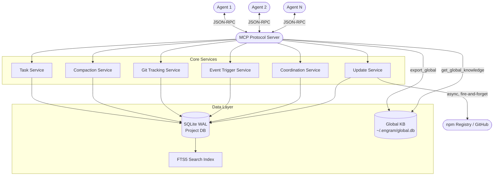

<div align="center">

# 🧠 Engram

> **Persistent Memory Cortex for AI coding agents. Gives agents session continuity, change tracking, decision logging, and multi-agent coordination across sessions.**


</div>

---

## 📋 Table of Contents

- [Overview](#overview)
- [Why Engram?](#why-engram)
- [Installation (Auto & Manual)](#installation)
- [✨ What's New in v1.7.0](#-whats-new-in-v170)
- [What's New in v1.6.0](#-whats-new-in-v160)
- [Features](#features)
- [Architecture](#architecture)
- [Tools Reference](#tools-reference)
- [Using with AI Agents](#using-with-ai-agents)
- [Multi-Agent Workflows](#multi-agent-workflows)
- [Contributing](#contributing)
- [License](#license)

---

## Overview

**Engram** is an [MCP (Model Context Protocol)](https://modelcontextprotocol.io) server that gives AI coding agents persistent memory across sessions. Instead of re-reading files, re-discovering architecture, and re-learning conventions every time a session starts, the agent calls `engram_session(action:"start")` and instantly receives everything it needs.

It operates seamlessly as a background brain for popular AI tools like **Claude Code**, **Claude Desktop**, **Cursor**, **Windsurf**, **Cline**, **Trae IDE**, and **GitHub Copilot** (VS Code & Visual Studio).

---

## Why Engram?

Every AI coding agent is **stateless by default**. Each new session starts from scratch:

- The agent re-reads file structures and re-discovers architecture.
- Architectural decisions made in previous sessions are forgotten.
- Conventions agreed upon are lost.
- Work-in-progress tasks have no continuity.
- **Time, tokens, and patience are wasted on repeated discovery.**

Engram solves this by providing a **persistent brain** using a native SQLite (WAL mode) database. An AI agent should only need to deeply review a file once. When you ask it to change something, it should already know where to go.

---

## ✨ What's New in v1.7.0

**v1.7.0** is a precision token-efficiency release — six improvement tracks with zero breaking changes to the 4-dispatcher API surface.

### 🔧 MCP Validation Crash Fix (Critical)

`z.array(z.unknown())` produced invalid JSON Schema (missing `items`) on `files`, `changes`, and `decisions` input arrays — causing silent validation crashes on VS Code Copilot and Cursor. **Fixed** with fully typed Zod schemas in all three affected inputs.

### ⚡ Default Search Limit: 20 → 8

`engram_memory(action:"search")` now defaults to 8 results (`DEFAULT_SEARCH_LIMIT`). Typ­ical lookups rarely need more. Still overridable via explicit `limit` param (up to 50).

### 📋 Convention Capping by Verbosity

Active conventions are sorted (enforced-first) and capped per verbosity: `nano`=0, `minimal`=5, `summary`=10, `full`=all. Total count + hint always returned.

### 🗂️ Tiered Tool Catalog (P2)

`buildToolCatalog(tier)` delivers the right detail level per agent:

- **Tier 2** (new agents) — full params ~1,200 tokens, once
- **Tier 1** (returning agents) — names + descriptions ~400 tokens
- **Tier 0** (familiar agents) — names only ~80 tokens

Delivery history tracked per `agent_name`. Recoverable anytime via `engram_find(action:"catalog")`.

### 🤖 Sub-Agent Session Mode (P3)

`engram_session(action:"start", agent_role:"sub", task_id:"T-42")` returns a focused context slice (~300-500 tokens) scoped to that task — instead of the full session boilerplate. Ideal for sub-agents spawned within an orchestrated multi-agent workflow.

### 🌐 Built-In Universal Mode (P4)

A single `engram` tool with an ~80 token schema — now available **inside the main server** without a separate proxy package:

```bash
# CLI flag
npx -y engram-mcp-server --mode=universal --project-root /your/project

# Environment variable
ENGRAM_MODE=universal npx -y engram-mcp-server --project-root /your/project
```

BM25 routing and fuzzy action resolution built-in. Use when you want minimal token overhead without running a separate proxy.

### 🗑️ 660 Lines of Dead Code Removed (P5)

`sessions.ts` shrank from 904 → 316 lines. The deleted `registerSessionTools()` registered old v1.5 individual tools that were never called post-v1.6 migration.

### 🔍 Smarter Convention Linting (P6)

`engram_find(action:"lint")` now extracts backtick-quoted identifiers for high-priority matching, uses whole-word regex (no false positives on shared stems), and has an expanded STOP_WORDS list. AR-06 agent rule updated to require `executive_summary` on `set_file_notes`.

> Full changelog: [RELEASE_NOTES.md](RELEASE_NOTES.md)

---

## ✨ What's New in v1.6.0

**v1.6.0** is the largest Engram release to date — fourteen feature tracks covering a complete lean-surface rearchitecture, deeper memory intelligence, smarter multi-agent coordination, and a new thin-client proxy.

### ⚡ Lean 4-Tool Dispatcher Surface — ~95% Fewer Schema Tokens

The MCP surface collapsed from 50+ individual tools to **4 dispatcher tools**: `engram_session`, `engram_memory`, `engram_admin`, `engram_find`. Every previous operation is still available — routed via `action` parameter. Token overhead drops from ~32,500 to ~1,600 per API call. Every AI agent benefits automatically with no configuration change.

### 📸 Checkpoints — Offload Working Memory Mid-Session

`engram_memory(action:"checkpoint")` saves current understanding, progress, and relevant files to a persistent `checkpoints` table. `get_checkpoint` restores it. Use when approaching context limits without ending the session.

### 🔬 Hash-Based Staleness Detection

File notes now store a **SHA-256 content hash** alongside `file_mtime`. When mtime matches but the hash differs, confidence is downgraded to `stale` — catching silent edits from formatters, git merges, and auto-saves that preserve timestamps.

### 📊 Tiered Verbosity — `nano` Mode

Four verbosity levels: `full`, `summary`, `minimal`, and the new **`nano`** — returns only session ID, counts, agent rules, and tool catalog. Under 100 tokens total. For ultra-lean session starts in constrained contexts.

### 🗂️ Executive Summary on File Notes

File notes now support an `executive_summary` field — a 2-3 sentence micro summary for Tier-1 reads. Agents can write it once; future sessions get instant context without opening the file.

### 🛡️ Agent Rules — Live-Loaded from GitHub

`start_session` now returns `agent_rules` fetched dynamically from the Engram README (7-day local cache at `.engram/agent_rules_cache.json`). Rules update automatically when the README changes — no agent reinstall required.

### 🔍 Convention Linting in `engram_find`

`engram_find(action:"lint", content:"...")` checks any code snippet against all active conventions and returns a `violations[]` array — useful before committing or during code review.

### 🔧 Git Hook Install/Remove via `engram_admin`

`engram_admin(action:"install_hooks")` and `remove_hooks` write/remove the Engram post-commit hook directly from within the MCP tool — no CLI needed.

### 🌐 Multi-Agent Specialization Routing

`engram_memory(action:"agent_sync", specializations:["typescript","database"])` stores agent skill tags. `claim_task` returns an advisory `match_score` comparing agent specializations vs task tags. New `route_task` action finds the best-matched agent for any task.

### 🔒 Agent Safety — File Locking & Pending Work

`engram_memory(action:"lock_file")` / `unlock_file` prevent concurrent write conflicts. `engram_memory(action:"begin_work")` / `end_work` declare intent before touching files. Abandoned work surfaces in `start_session` as `abandoned_work`.

### 🌡️ Context Pressure Detection

`check_events` fires `context_pressure` at 50%/70%/85% so agents know when to wrap up before hitting the context wall.

### 🤝 Session Handoffs

`engram_session(action:"handoff")` packages open tasks, last file touched, git branch, and instructions for the next agent. Auto-surfaced in `start_session` as `handoff_pending`.

### 🎬 Session Replay & Diagnostics

Every MCP tool call is logged to `tool_call_log`. Session Replay reconstructs the complete chronological timeline of any session.

### 📦 `engram-thin-client` Package

New `packages/engram-thin-client/` proxy enables Anthropic's `defer_loading` beta — tools are defined with `defer_loading: true` so **zero** schema tokens are consumed upfront. Claude discovers tools on demand via BM25 search. For agents using the Anthropic API directly.

### 📦 `engram-universal-client` Package

New `packages/engram-universal-thin-client/` proxy exposes Engram as a **single MCP tool** with an ~80-token schema — works with **every** MCP-compatible agent (Cursor, VS Code Copilot, Windsurf, Gemini CLI, GPT-based IDEs, Claude). BM25 routing maps free-text or near-miss action strings to the correct dispatcher. No Anthropic API required.

| Approach                        | Schema tokens/call | Works universally            |
| ------------------------------- | ------------------ | ---------------------------- |
| v1.5 (50+ tools)                | ~32,500            | ✅                           |
| v1.6 dispatcher (4 tools)       | ~1,600             | ✅                           |
| `engram-thin-client`            | ~0 (deferred)      | ⚠️ Anthropic only            |
| `engram-universal-client` proxy | ~80                | ✅ All agents                |
| **v1.7 `--mode=universal`**     | **~80**            | ✅ **All agents (built-in)** |

> Full changelog: [RELEASE_NOTES.md](RELEASE_NOTES.md) · Previous release: **v1.5.0** — Multi-Agent Coordination, Trustworthy Context & Knowledge Intelligence.

---

## Installation

Engram is published to the npm registry. **You do not need to download or compile any code.** Your IDE will download and run the latest version automatically using `npx`.

### Prerequisites

Engram uses **SQLite** for persistent storage via the `better-sqlite3` library, which includes a native C++ addon. On most systems this is handled automatically via prebuilt binaries. However, if no prebuilt binary matches your platform, npm will attempt to compile from source — which requires:

- **Windows:** [Node.js](https://nodejs.org) (v18+) and [Windows Build Tools](https://github.com/nodejs/node-gyp#on-windows) (Visual C++ Build Tools + Python). Install them with:
    ```bash
    npm install -g windows-build-tools
    ```
    Or install **"Desktop development with C++"** via the [Visual Studio Installer](https://visualstudio.microsoft.com/downloads/).
- **Mac:** Xcode Command Line Tools (`xcode-select --install`)
- **Linux:** `build-essential` and `python3` (`sudo apt install build-essential python3`)

### Option 1: The Magic Installer (Interactive)

Run this single command in your terminal. It will automatically detect your IDE and safely inject the configuration:

```bash
npx -y engram-mcp-server --install
```

**Non-interactive mode (CI/CD / Scripting):**

```bash
npx -y engram-mcp-server install --ide vscode --yes
```

**Clean removal:**

```bash
npx -y engram-mcp-server install --remove --ide claudecode
```

**Check installed version vs npm latest:**

```bash
npx -y engram-mcp-server --check
```

### Option 2: Global Install (Windows Fallback)

If `npx -y engram-mcp-server --install` fails on Windows, install globally first then run the installer:

```bash
npm install -g engram-mcp-server
engram install --ide <your-ide>
```

> **Note:** During install you may see `npm warn deprecated prebuild-install@7.1.3`. This is a cosmetic warning from a transitive dependency used to download SQLite prebuilt binaries. It does not affect functionality and is safe to ignore.

### Option 3: Universal Mode — Built-In Single-Tool Mode (v1.7+)

Starting with v1.7.0, the main server itself can expose a **single `engram` tool** (~80 token schema) via the `--mode=universal` flag — no separate proxy package needed. BM25 fuzzy routing and `discover` action built in.

**VS Code Copilot** (`.vscode/mcp.json`):

```json
{
    "servers": {
        "engram": {
            "type": "stdio",
            "command": "npx",
            "args": [
                "-y",
                "engram-mcp-server",
                "--mode=universal",
                "--project-root",
                "${workspaceFolder}"
            ]
        }
    }
}
```

**Cursor** (`~/.cursor/mcp.json`), **Claude Desktop**, **Windsurf** — same pattern with `--mode=universal` added to `args`.

Or set `ENGRAM_MODE=universal` as an environment variable instead of using the flag.

### Option 4: Universal Thin Client Package (Legacy — v1.6.x)

The original separate proxy package for maximum token efficiency. Still works; prefer Option 3 for v1.7+ installs.

**Cursor** (`~/.cursor/mcp.json`):

```json
{
    "mcpServers": {
        "engram": {
            "command": "npx",
            "args": [
                "-y",
                "engram-universal-client",
                "--project-root",
                "/absolute/path/to/project"
            ]
        }
    }
}
```

**VS Code Copilot** (`.vscode/mcp.json`):

```json
{
    "servers": {
        "engram": {
            "type": "stdio",
            "command": "npx",
            "args": [
                "-y",
                "engram-universal-client",
                "--project-root",
                "${workspaceFolder}"
            ]
        }
    }
}
```

**Windsurf / Gemini CLI / any MCP agent** — same pattern, replace `--project-root` with your project path.

> The agent should call `engram({"action":"start"})` first. The response includes `tool_catalog` with all available actions.

### Option 5: Manual Configuration

If you prefer to configure manually, find your IDE below:

<details>
<summary><strong>Claude Code (CLI)</strong></summary>

Run this in your terminal:

```bash
claude mcp add-json --scope=user engram '{"type":"stdio","command":"cmd","args":["/c","npx","-y","engram-mcp-server"]}'
```

_(Omit `"command":"cmd"` and `"args":["/c", ...]` on Mac/Linux, use just `"command":"npx"`)._

</details>

<details>
<summary><strong>Claude Desktop</strong></summary>

Add to your `claude_desktop_config.json`:

- **Windows:** `%APPDATA%\Claude\claude_desktop_config.json`
- **Mac:** `~/Library/Application Support/Claude/claude_desktop_config.json`

```json
{
    "mcpServers": {
        "engram": {
            "command": "npx",
            "args": ["-y", "engram-mcp-server"]
        }
    }
}
```

</details>

<details>
<summary><strong>VS Code (GitHub Copilot)</strong></summary>

Create `.vscode/mcp.json` in your project root, or add to your global user `settings.json`:

```json
{
    "servers": {
        "engram": {
            "type": "stdio",
            "command": "npx",
            "args": ["-y", "engram-mcp-server"]
        }
    }
}
```

</details>

<details>
<summary><strong>Cursor & Windsurf</strong></summary>

For Cursor, edit `~/.cursor/mcp.json`. For Windsurf, edit `~/.codeium/windsurf/mcp_config.json`:

```json
{
    "mcpServers": {
        "engram": {
            "command": "npx",
            "args": ["-y", "engram-mcp-server"]
        }
    }
}
```

</details>

<details>
<summary><strong>Visual Studio 2022/2026</strong></summary>

Create `.vs/mcp.json` in your solution root:

```json
{
    "mcpServers": {
        "engram": {
            "command": "npx",
            "args": ["-y", "engram-mcp-server"]
        }
    }
}
```

</details>

<details>
<summary><strong>Trae IDE</strong></summary>

For Trae IDE, edit `.trae/mcp.json` in your project root:

```json
{
    "mcpServers": {
        "engram": {
            "type": "stdio",
            "command": "npx",
            "args": ["-y", "engram-mcp-server"]
        }
    }
}
```

</details>

<details>
<summary><strong>JetBrains (Copilot Plugin)</strong></summary>

Edit `~/.config/github-copilot/intellij/mcp.json` or use the built-in Settings → MCP Server:

```json
{
    "mcpServers": {
        "engram": {
            "command": "npx",
            "args": ["-y", "engram-mcp-server"]
        }
    }
}
```

</details>

<details>
<summary><strong>Cline / Roo Code</strong></summary>

In the extension settings → MCP Servers:

```json
{
    "mcpServers": {
        "engram": {
            "command": "npx",
            "args": ["-y", "engram-mcp-server"]
        }
    }
}
```

</details>

---

## Features

- 🧠 **Session Continuity:** Each session automatically receives the previous session's summary, changes, decisions, and full project context. Use the `focus` parameter to FTS5-rank all context around the topic you're about to work on. `suggested_focus` is returned automatically when no focus is provided.
- 🔐 **Trustworthy Context:** File notes track `file_mtime` and `git_branch` at write time. Returns `confidence` (`high`, `medium`, `stale`, `unknown`) and a `branch_warning` when the current branch differs from when notes were stored.
- 🔒 **Agent Safety:** `engram_memory(action:"lock_file")` / `unlock_file` prevent concurrent write conflicts. `begin_work` / `end_work` declare intent before touching files. Abandoned work from prior sessions surfaces in `start_session`.
- 🤖 **Multi-Agent Coordination:** Multiple agents collaborate simultaneously. Atomic task claiming prevents duplicates. `route_task` finds the best-matched agent. `agent_sync` tracks who is alive and their specializations.
- 🤝 **Session Handoffs:** `engram_session(action:"handoff")` packages context (tasks, files, git branch, instructions) for graceful agent-to-agent transfers. `acknowledge_handoff` clears the pending handoff.
- 🌡️ **Context Pressure Detection:** `engram_memory(action:"check_events")` fires at 50%/70%/85% context fill — giving agents advance warning before hitting the context wall.
- ⏰ **Scheduled Events:** Postpone tasks or set reminders. Triggers include `next_session`, `datetime`, or `task_complete`.
- 📝 **Change Tracking:** Records every file modification with context. Combines agent-recorded changes with `git` history. Git hook integration (`--install-hooks`) auto-records commits.
- 🏗️ **Architectural Decision Records:** Logs design decisions with rationale, affected files, and tags forever. `depends_on` field models prerequisite decision chains. FTS5 deduplication warns on similar existing decisions.
- 📁 **File Intelligence:** Stores per-file notes (purpose, deps, layer, complexity) with branch-aware staleness detection preventing endless re-reads.
- 📐 **Convention Tracking:** Records and enforces project conventions (naming, testing, styling).
- ✅ **Task Management:** Work items persist across sessions with priority, status, and multi-agent claiming. End-session warns on unclosed claimed tasks.
- 🔍 **Precise Full-Text Search (FTS5):** High-performance ranked search across all memory, with `context_chars` enrichment and per-result `confidence` levels for file note results.
- 🎬 **Session Replay:** Reconstructs the complete tool-call + change + decision timeline for any session via the `tool_call_log` table.
- 💾 **Backup & Restore:** `engram_admin(action:"backup")` creates timestamped SQLite copies to any path (like Dropbox/OneDrive) for cross-machine portability.
- 📊 **Reports, Stats & Commit Suggestions:** Generate Markdown project reports, per-agent activity metrics, and conventional commit messages from session data.

---

## Architecture



---

## Tools Reference

Engram v1.7.0 exposes **4 dispatcher tools** (or 1 tool in `--mode=universal`). Every operation routes through one of them via an `action` parameter. Token overhead is ~1,600 tokens for the standard surface, or ~80 tokens in universal mode — a ~95-99% reduction from the previous 50-tool surface.

> **Use `engram_find`** when you don't know the exact `action` name. It returns parameter schemas and descriptions for any operation.

### `engram_session` — Session Lifecycle

| Action                       | Purpose                                                                                                                                                        |
| ---------------------------- | -------------------------------------------------------------------------------------------------------------------------------------------------------------- |
| `start`                      | Begin a session. Returns context, agent rules, tool catalog, handoff_pending, abandoned_work, suggested_focus. Pass `verbosity` to control response depth.     |
| `start` + `agent_role:"sub"` | **v1.7** Sub-agent mode. Pass `task_id` to receive focused context (~300-500t): task details, relevant files, matching decisions, and capped conventions only. |
| `end`                        | End session with a summary. Warns on unclosed claimed tasks.                                                                                                   |
| `get_history`                | Retrieve past session summaries.                                                                                                                               |
| `handoff`                    | Package open tasks, git branch, and instructions for the next agent.                                                                                           |
| `acknowledge_handoff`        | Clear a pending handoff from future start responses.                                                                                                           |

### `engram_memory` — All Memory Operations

| Action                   | Purpose                                                                                                             |
| ------------------------ | ------------------------------------------------------------------------------------------------------------------- |
| `get_file_notes`         | Retrieve file notes with `confidence` (hash-based staleness), `branch_warning`, `lock_status`, `executive_summary`. |
| `set_file_notes`         | Store file intelligence (purpose, layer, complexity, dependencies, `executive_summary`, `content_hash`).            |
| `set_file_notes_batch`   | Store notes for multiple files atomically.                                                                          |
| `record_change`          | Log file changes with `change_type`, `description`, `impact_scope`, `diff_summary`.                                 |
| `get_file_history`       | Change history for a file.                                                                                          |
| `record_decision`        | Log architectural decisions with `rationale`, `tags`, `affected_files`, `depends_on`, `supersedes`.                 |
| `record_decisions_batch` | Record multiple decisions atomically.                                                                               |
| `get_decisions`          | Retrieve decisions by status, tag, file, or dependency chain.                                                       |
| `update_decision`        | Change decision status. Returns `cascade_warning` if dependents exist.                                              |
| `add_convention`         | Record a project convention.                                                                                        |
| `get_conventions`        | Retrieve active conventions.                                                                                        |
| `create_task`            | Create a persistent work item with priority, tags, and blocking chains.                                             |
| `update_task`            | Update task status, priority, description, or blocking.                                                             |
| `get_tasks`              | Retrieve tasks by status, priority, or tag.                                                                         |
| `checkpoint`             | Save current understanding + progress to a persistent checkpoint.                                                   |
| `get_checkpoint`         | Restore the last saved checkpoint.                                                                                  |
| `search`                 | FTS5-ranked full-text search across all memory. Results include `confidence`.                                       |
| `what_changed`           | Diff report of all changes since a given time or session.                                                           |
| `get_dependency_map`     | File dependency graph for a module.                                                                                 |
| `record_milestone`       | Log a project milestone.                                                                                            |
| `schedule_event`         | Schedule deferred work with a trigger type.                                                                         |
| `check_events`           | Check triggered events including `context_pressure` at 50%/70%/85%.                                                 |
| `agent_sync`             | Heartbeat — registers agent with optional `specializations[]`. Returns unread broadcasts.                           |
| `claim_task`             | Atomically claim a task. Returns advisory `match_score` vs agent specializations.                                   |
| `release_task`           | Release a claimed task back to the pool.                                                                            |
| `get_agents`             | List all registered agents with status, last-seen, and specializations.                                             |
| `route_task`             | Find the best-matched agent for a task based on specialization scoring.                                             |
| `broadcast`              | Send a message to all agents.                                                                                       |
| `dump`                   | Auto-classify unstructured text into decisions, tasks, conventions, findings.                                       |

### `engram_admin` — Maintenance & Git Hooks

| Action          | Purpose                                                    |
| --------------- | ---------------------------------------------------------- |
| `backup`        | Create a database backup.                                  |
| `restore`       | Restore from a backup.                                     |
| `list_backups`  | List available backup files.                               |
| `export`        | Export all memory to JSON.                                 |
| `import`        | Import from exported JSON.                                 |
| `compact`       | Compress old session data.                                 |
| `clear`         | Clear memory tables (destructive — requires confirmation). |
| `stats`         | Project stats with per-agent contribution metrics.         |
| `health`        | Database health check and diagnostics.                     |
| `config`        | Read or update runtime config values.                      |
| `scan_project`  | Scan and cache project filesystem structure.               |
| `install_hooks` | Write Engram post-commit git hook to `.git/hooks/`.        |
| `remove_hooks`  | Remove Engram hook from `.git/hooks/post-commit`.          |

### `engram_find` — Discovery & Linting

| Action               | Purpose                                                                                 |
| -------------------- | --------------------------------------------------------------------------------------- |
| `search` _(default)_ | Search the tool catalog by keyword. Returns action name, description, and param schema. |
| `lint`               | Check a code/text snippet against all active conventions. Returns `violations[]`.       |

---

## Using with AI Agents

Add the following to your agent's system prompt or custom instructions — Cursor Rules, `.github/copilot-instructions.md`, `CLAUDE.md`, or whichever file your IDE reads. The goal is to make the agent consult Engram **before** doing work, not just after. That's where most of the token and time savings come from.

> You have access to **Engram**, a persistent memory MCP server. It stores everything learned about this project across all sessions: file notes, architectural decisions, conventions, tasks, and change history. Use it to avoid re-reading files already analysed, re-debating settled decisions, and re-discovering known context.

---

### 🟢 Session Start

**Always call `engram_session(action:"start")` first** — before reading any file or taking any action. Pass `focus` when you know what you're about to work on — it FTS5-ranks returned context around that topic.

```js
engram_session({
    action: "start",
    agent_name: "claude",
    verbosity: "summary",
    focus: "authentication refactor",
});
```

Act on everything it returns:

| Field                      | What to do                                                                                                                 |
| -------------------------- | -------------------------------------------------------------------------------------------------------------------------- |
| `previous_session.summary` | Read immediately. Do not re-explore what is already known.                                                                 |
| `active_decisions`         | Binding. Follow them; do not re-debate. Supersede with `engram_memory(action:"record_decision")` if they must change.      |
| `active_conventions`       | Enforce in every file you touch this session.                                                                              |
| `open_tasks`               | Pending work items. Ask the user which to focus on if unclear.                                                             |
| `abandoned_work`           | Work items left open by a previous session that ended unexpectedly. Review and resume or close.                            |
| `handoff_pending`          | A structured handoff from the previous agent. Read instructions, then call `engram_session(action:"acknowledge_handoff")`. |
| `suggested_focus`          | Auto-derived topic hint. Pass as `focus` on the next `start` call for filtered context.                                    |
| `triggered_events`         | Scheduled reminders or deferred work now triggered. Act on them.                                                           |
| `agent_rules`              | Live-loaded rules from the Engram README. Treat as binding session instructions.                                           |
| `tool_catalog`             | Full list of available `engram_memory` and `engram_admin` actions with schemas.                                            |
| `update_available`         | Tell the user: _"Engram v{available_version} is available. Update, skip, or postpone?"_                                    |

If `update_available` is set, respond to the user's choice:

- **Update** → `npx -y engram-mcp-server install`
- **Skip** → `engram_admin({ action: "config", op: "set", key: "auto_update_skip_version", value: "{version}" })`
- **Postpone** → `engram_admin({ action: "config", op: "set", key: "auto_update_remind_after", value: "7d" })`
- **Disable** → `engram_admin({ action: "config", op: "set", key: "auto_update_check", value: "false" })`

---

### 📂 Before Reading Any File

Always check Engram before opening a file:

```js
engram_memory({ action: "get_file_notes", file_path: "path/to/file.ts" });
```

- **`confidence: "high"`** → Use stored notes. Only open the file if you need to edit it.
- **`confidence: "medium"`** → Notes exist but the file may have minor changes. Use as a guide; open if precision matters.
- **`confidence: "stale"`** → The file has changed significantly since notes were stored. Re-read and update notes.
- **No notes** → Read the file, then immediately call `engram_memory(action:"set_file_notes")` with `file_path`, `purpose`, `dependencies`, `dependents`, `layer`, `complexity`, `notes`. Batch multiple files with `set_file_notes_batch`.

> **Rule:** Never read a file already analysed in a previous session without checking Engram first.

---

### 🏛️ Before Making Any Design Decision

Before choosing an implementation approach, search for an existing decision:

```js
engram_memory({
    action: "search",
    query: "relevant keywords",
    scope: "decisions",
});
```

- **Decision exists** → Follow it.
- **Should change** → Explain why, then supersede:
    ```js
    engram_memory({ action: "record_decision", decision: "...", supersedes: <id> })
    ```
- **No decision exists** → Make the call and record it:
    ```js
    engram_memory({
        action: "record_decision",
        decision,
        rationale,
        affected_files,
        tags,
    });
    ```

---

### ✏️ When Modifying Files

After every meaningful change, record it. Batch where possible:

```js
engram_memory({
    action: "record_change",
    changes: [
        {
            file_path,
            change_type, // created | modified | refactored | deleted | renamed | moved | config_changed
            description, // What changed AND why — not just the action. Future sessions read this.
            impact_scope, // local | module | cross_module | global
        },
    ],
});
```

---

### 🔍 When You Don't Know Something

Search Engram before asking the user — they may have already explained it to a previous session:

```js
engram_memory({ action: "search", query: "keywords", context_chars: 200 });
engram_admin({ action: "scan_project" }); // project structure
engram_memory({ action: "get_decisions" }); // architecture questions
engram_memory({ action: "get_conventions" }); // style / pattern questions
engram_memory({ action: "get_file_notes", file_path: "..." }); // what is known about a file
engram_find({ query: "what I want to do" }); // discover the right action
```

---

### 🔴 Session End

Before ending every session:

1. Record all file changes not yet recorded.
2. Create tasks for anything incomplete or blocked:
    ```js
    engram_memory({ action: "create_task", title, description, priority });
    ```
3. Call `engram_session({ action: "end", summary: "..." })` with a summary that includes:
    - Exactly what was done — file names, function names, specific changes
    - What is pending or blocked, and why
    - Any new patterns, gotchas, or constraints discovered
    - Which tasks were completed or partially done

A precise summary is what allows the next session to start immediately without re-reading files or re-asking the user for context.

---

## Multi-Agent Workflows

When running multiple agents simultaneously on the same project, use the coordination tools to keep them in sync:

### Agent Registration & Heartbeat

Each agent should call `agent_sync` periodically to stay visible and receive broadcasts:

```js
// On startup and every ~2 minutes
engram_memory({
    action: "agent_sync",
    agent_id: "agent-frontend",
    agent_name: "Frontend Specialist",
    status: "working",
    current_task_id: 42,
    specializations: ["typescript", "react", "ui"], // ← new in v1.6.0
});
// Returns: { agent, unread_broadcasts: [...] }
```

### Atomic Task Claiming

Use `claim_task` to safely grab a task without duplicating work. Returns advisory `match_score`:

```js
engram_memory({
    action: "claim_task",
    task_id: 42,
    agent_id: "agent-frontend",
});
// Returns: { task, match_score: 85, match_warning? }
```

### Find the Best Agent for a Task

```js
engram_memory({ action: "route_task", task_id: 42 });
// Returns: { best_match: { agent_id, agent_name, match_score }, all_candidates: [...] }
```

### Broadcasting Between Agents

```js
engram_memory({
    action: "broadcast",
    from_agent: "agent-backend",
    message:
        "⚠️ auth.ts API changed — agents touching auth endpoints need to update",
    expires_in_minutes: 60,
});
```

### The `dump` Power Tool

```js
engram_memory({
    action: "dump",
    raw_text: `
    We decided to use JWT with 15-minute expiry.
    TODO: add refresh token endpoint
    Always use bcrypt cost factor 12.
  `,
    agent_id: "agent-research",
});
// Auto-classifies into decisions, tasks, conventions, findings
```

### Coordination Quick Reference

| Situation                  | Call                                                      |
| -------------------------- | --------------------------------------------------------- |
| Register / heartbeat       | `engram_memory(action:"agent_sync")`                      |
| Find best agent for task   | `engram_memory(action:"route_task", task_id)`             |
| Claim a task atomically    | `engram_memory(action:"claim_task", task_id, agent_id)`   |
| Release a task             | `engram_memory(action:"release_task", task_id, agent_id)` |
| List active agents         | `engram_memory(action:"get_agents")`                      |
| Send a team message        | `engram_memory(action:"broadcast", message, from_agent)`  |
| Dump unstructured findings | `engram_memory(action:"dump", raw_text, agent_id)`        |

---

<!-- AGENT_RULES_START -->

```json
[
    {
        "priority": "CRITICAL",
        "rule": "Call engram_session(action:'start', verbosity:'summary') FIRST — before reading any file or taking any action."
    },
    {
        "priority": "CRITICAL",
        "rule": "Call engram_memory(action:'get_file_notes', file_path) before opening any file. Use notes to skip re-reading already-analysed files."
    },
    {
        "priority": "CRITICAL",
        "rule": "Call engram_memory(action:'record_change') after every file edit — changes, file_path, change_type, description, impact_scope."
    },
    {
        "priority": "CRITICAL",
        "rule": "Call engram_session(action:'end', summary) before terminating — be specific about what was done, what is pending, and any blockers."
    },
    {
        "priority": "HIGH",
        "rule": "Call engram_memory(action:'record_decision') for every architectural or design choice — even small ones."
    },
    {
        "priority": "HIGH",
        "rule": "Check engram_memory(action:'get_decisions') before starting any implementation to avoid contradicting existing decisions."
    },
    {
        "priority": "HIGH",
        "rule": "Use engram_find(query) when unsure which action to call — never guess parameter names."
    },
    {
        "priority": "MEDIUM",
        "rule": "Use engram_memory(action:'checkpoint') when approaching context limits — save current_understanding and progress before losing context."
    },
    {
        "priority": "MEDIUM",
        "rule": "Respect active_conventions returned by start_session — enforce them in every file touched this session."
    },
    {
        "priority": "MEDIUM",
        "rule": "Use verbosity:'nano' or 'minimal' for start_session when context is tight; use 'summary' (default) for normal sessions."
    }
]
```

<!-- AGENT_RULES_END -->

---

## Contributing

We welcome contributions!

1. Fork the repo and create your branch (`git checkout -b feature/amazing-idea`).
2. Install dependencies: `npm install`.
3. Build the project: `npm run build`.
4. Run tests: `npm test` (Uses Vitest).
5. Commit your changes and open a Pull Request.

---

## License

This project is licensed under the [MIT License](LICENSE).

---

<div align="center">
  <em>Because your AI agent shouldn't have amnesia.</em><br/>
  <strong>Copyright &copy; 2026 Keggan Student - Tanzania</strong>
</div>
