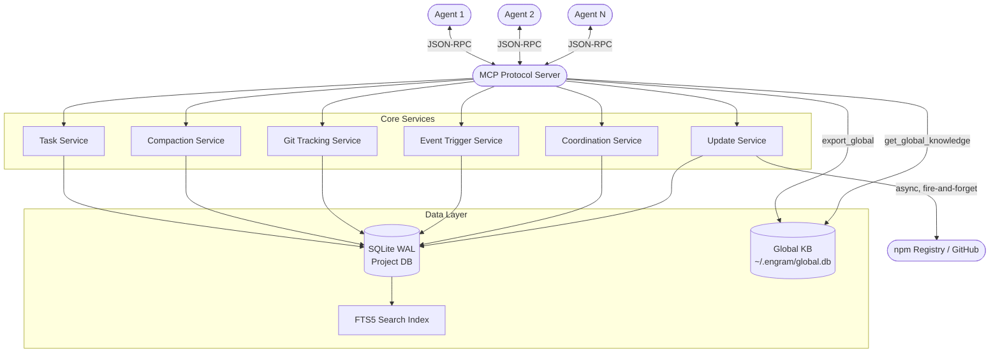

<div align="center">


# Engram

> **Persistent Memory Cortex for AI coding agents. Gives agents session continuity, change tracking, decision logging, and multi-agent coordination across sessions.**


</div>

---

> ⭐ **If Engram saves you tokens and context, give it a star — it helps other developers find it.**

---

## 📋 Table of Contents

- [Overview](#overview)
- [Why Engram?](#why-engram)
- [How Engram Works?](#how-engram-works)
- [Installation](#installation)
- [Features](#features)
- [Dashboard](#dashboard)
- [Architecture](#architecture)
- [Tools Reference](#tools-reference)
- [AI Agent Instructions](#ai-agent-instructions)
- [Multi-Agent Workflows](#multi-agent-workflows)
- [Contributing](#contributing)
- [Security](#security)
- [Author](#author)
- [License](#license)

---

## Overview

**Engram** is an [MCP (Model Context Protocol)](https://modelcontextprotocol.io) server that gives AI coding agents persistent memory across sessions. Instead of re-reading files, re-discovering architecture, and re-learning conventions every time a session starts, the agent calls `engram_session(action:"start")` and instantly receives everything it needs.

It operates seamlessly as a background brain for popular AI tools like **Claude Code**, **Claude Desktop**, **Cursor**, **Windsurf**, **Cline**, **Trae IDE**, **Antigravity IDE**, **Android Studio**, and **GitHub Copilot** (VS Code & Visual Studio).

---

## Why Engram?

Every AI coding agent is **stateless by default**. Each new session starts from scratch:

- The agent re-reads file structures and re-discovers architecture.
- Architectural decisions made in previous sessions are forgotten.
- Conventions agreed upon are lost.
- Work-in-progress tasks have no continuity.
- **Time, tokens, and patience are wasted on repeated discovery.**

Engram solves this by providing a **persistent brain** using a native SQLite (WAL mode) database. An AI agent should only need to deeply review a file once. When you ask it to change something, it should already know where to go.

### How Engram Compares

| Tool | Approach | Local / No cloud | MCP native | Multi-agent | Works today |
|------|----------|:---:|:---:|:---:|:---:|
| **Engram** | Structured SQLite memory | ✅ | ✅ | ✅ | ✅ |
| mem0 | Cloud vector DB | ❌ | ⚠️ wrapper | ⚠️ | ✅ |
| MemGPT / Letta | In-context manipulation | ✅ | ❌ | ❌ | ✅ |
| Plain `CLAUDE.md` | Static text file | ✅ | ✅ | ❌ | ✅ |

Engram is the only solution that is **local-first, MCP-native, multi-agent-ready, and structured** (queryable, rankable, exportable) — not just a text file appended to every prompt.

---

## How Engram Works?

Engram runs as a local MCP server alongside your AI tool. It maintains a **project-local SQLite database** at `.engram/memory.db` — one per project, created automatically on first use. No cloud, no API keys, no data leaving your machine.

### The Session Lifecycle

```
┌──────────────────────────────────────────────────────────────────────────┐
│                          AGENT SESSION LIFECYCLE                          │
├──────────────┬──────────────────────────────────────────────────────────┤
│   Session    │  engram_session(action:"start")                           │
│    Start     │  ← previous summary, open tasks, decisions, file notes,  │
│              │     conventions, triggered events — all ranked by focus   │
├──────────────┼──────────────────────────────────────────────────────────┤
│  Active Work │  get_file_notes  → skip re-reading if notes are fresh     │
│              │  record_change   → every file edit captured with context  │
│              │  record_decision → why you built it, persisted forever    │
│              │  add_convention  → project standards stored once, used ∞  │
│              │  create_task     → work items survive session boundaries  │
├──────────────┼──────────────────────────────────────────────────────────┤
│   Context    │  check_events fires at 50% / 70% / 85% fill              │
│   Pressure   │  → checkpoint to offload working memory mid-session       │
│              │  → or end early and resume cleanly in the next session    │
├──────────────┼──────────────────────────────────────────────────────────┤
│   Session    │  engram_session(action:"end", summary:"...")              │
│     End      │  → summary stored, open tasks preserved, memory locked   │
│              │  → next session — same agent or different — starts fresh  │
└──────────────┴──────────────────────────────────────────────────────────┘
```

### What the Agent Receives at Start

When an agent calls `engram_session(action:"start", focus:"topic")`, the response includes:

| Field                      | What it contains                                                          |
| -------------------------- | ------------------------------------------------------------------------- |
| `previous_session.summary` | What was done last session — files, functions, blockers                   |
| `active_decisions`         | Binding architectural decisions. Follow them or supersede with rationale. |
| `active_conventions`       | Project standards (naming, patterns, style) — enforced every session      |
| `open_tasks`               | Pending work items with priority and blocking chains                      |
| `abandoned_work`           | Work declared via `begin_work` that was never closed — resume or discard  |
| `handoff_pending`          | Structured handoff from the previous agent — instructions, branch, tasks  |
| `triggered_events`         | Scheduled reminders or deferred tasks now due                             |
| `agent_rules`              | Live-loaded behavioral rules from the README (7-day cache)                |
| `tool_catalog`             | Available actions, scoped to the agent's familiarity tier                 |

All context is **FTS5-ranked** around the `focus` topic — the most relevant memory surfaces first. The `suggested_focus` field auto-derives the topic for the next session when none is provided.

### Token Efficiency by Mode

| Mode                          | Schema tokens | Works with         |
| ----------------------------- | ------------- | ------------------ |
| Standard 4-dispatcher         | ~1,600        | All MCP agents     |
| `--mode=universal` (built-in) | ~80           | All MCP agents     |
| `engram-thin-client`          | ~0 (deferred) | Anthropic API only |

### Storage

All data lives in a local SQLite WAL database. There is no telemetry, no external sync, and no authentication surface. The database is a plain file — portable via `backup`, exportable to JSON, restorable on any machine.

---

## Installation

Engram is published to the npm registry. **You do not need to download or compile any code.** Your IDE will download and run the latest version automatically using `npx`.

### Prerequisites

Engram uses **SQLite** for persistent storage via the `better-sqlite3` library, which includes a native C++ addon. On most systems this is handled automatically via prebuilt binaries. However, if no prebuilt binary matches your platform, npm will attempt to compile from source — which requires:

- **Windows:** [Node.js](https://nodejs.org) (v18+) and [Windows Build Tools](https://github.com/nodejs/node-gyp#on-windows) (Visual C++ Build Tools + Python). Install them with:
    ```bash
    npm install -g windows-build-tools
    ```
    Or install **"Desktop development with C++"** via the [Visual Studio Installer](https://visualstudio.microsoft.com/downloads/).
- **Mac:** Xcode Command Line Tools (`xcode-select --install`)
- **Linux:** `build-essential` and `python3` (`sudo apt install build-essential python3`)

### Option 1: The Magic Installer (Interactive)

Run this single command in your terminal. It will automatically detect your IDE and safely inject the configuration:

```bash
npx -y engram-mcp-server --install
```

**Universal mode** (~80 token single-tool schema — recommended for token-conscious setups):

```bash
npx -y engram-mcp-server --install --universal
```

**Non-interactive mode (CI/CD / Scripting):**

```bash
npx -y engram-mcp-server install --ide vscode --yes
npx -y engram-mcp-server install --ide vscode --universal --yes
```

**Clean removal:**

```bash
npx -y engram-mcp-server install --remove --ide claudecode
```

**Check installed version vs npm latest:**

```bash
npx -y engram-mcp-server --check
```

### Option 2: Global Install (Windows Fallback)

If `npx -y engram-mcp-server --install` fails on Windows, install globally first then run the installer:

```bash
npm install -g engram-mcp-server
engram install --ide <your-ide>
```

Available `--ide` values: `vscode`, `cursor`, `windsurf`, `antigravity`, `claudecode`, `claudedesktop`, `visualstudio`, `cline`, `roocode`, `geminicli`, `firebasestudio`, `trae`, `jetbrains`, `androidstudio`

> **Note:** During install you may see `npm warn deprecated prebuild-install@7.1.3`. This is a cosmetic warning from a transitive dependency used to download SQLite prebuilt binaries. It does not affect functionality and is safe to ignore.

### Option 3: Universal Mode — Built-In Single-Tool Mode (v1.7+)

Starting with v1.7.0, the main server itself can expose a **single `engram` tool** (~80 token schema) via the `--mode=universal` flag — no separate proxy package needed. BM25 fuzzy routing and `discover` action built in.

**VS Code Copilot** (`.vscode/mcp.json`):

```json
{
    "servers": {
        "engram": {
            "type": "stdio",
            "command": "npx",
            "args": [
                "-y",
                "engram-mcp-server",
                "--mode=universal",
                "--project-root",
                "${workspaceFolder}"
            ]
        }
    }
}
```

**Cursor** (`~/.cursor/mcp.json`), **Claude Desktop**, **Windsurf** — same pattern with `--mode=universal` added to `args`.

Or set `ENGRAM_MODE=universal` as an environment variable instead of using the flag.

### Option 4: Universal Thin Client Package (Legacy — v1.6.x)

The original separate proxy package for maximum token efficiency. Still works; prefer Option 3 for v1.7+ installs.

**Cursor** (`~/.cursor/mcp.json`):

```json
{
    "mcpServers": {
        "engram": {
            "command": "npx",
            "args": [
                "-y",
                "engram-universal-client",
                "--project-root",
                "/absolute/path/to/project"
            ]
        }
    }
}
```

**VS Code Copilot** (`.vscode/mcp.json`):

```json
{
    "servers": {
        "engram": {
            "type": "stdio",
            "command": "npx",
            "args": [
                "-y",
                "engram-universal-client",
                "--project-root",
                "${workspaceFolder}"
            ]
        }
    }
}
```

**Windsurf / Gemini CLI / any MCP agent** — same pattern, replace `--project-root` with your project path.

> The agent should call `engram({"action":"start"})` first. The response includes `tool_catalog` with all available actions.

### Engram Database Location

Engram maintains a **SQLite database** — one per project — that stores all agent memory.

| How you run Engram | Database path |
|---|---|
| Project-local MCP config (default) | `<project-root>/.engram/memory.db` — auto-detected via git root, `.engram` marker, `package.json` walk-up |
| No project root found (non-project dir) | `~/.engram/global/memory.db` — global fallback, logged as a warning |
| `npm install -g engram-mcp-server` + global IDE config (no `--project-root`) | `~/.engram/global/memory.db` — global memory shared across all projects |

> **`--project-root` flag** — The most reliable way to pin the database. IDEs that support workspace variables (VS Code, Cursor, Visual Studio, Trae) inject this automatically. For IDEs without workspace variable support (Windsurf, Antigravity, Gemini CLI, Claude Desktop), add `"--project-root=/absolute/path/to/your/project"` to the `args` array manually.
>
> `npm install -g engram-mcp-server` makes the `engram` command available globally. When Engram is configured in a **user-level** (global) IDE config without `--project-root`, it cannot detect a specific project and initializes its database at the global fallback `~/.engram/global/memory.db`. This is intentional — a global config serves all projects simultaneously.

---

### Option 5: Manual Configuration

If you prefer to configure manually, find your IDE below. Each entry shows the correct config file path and JSON format.

> **Config key note:** VS Code, Visual Studio, and JetBrains use `"servers"` as the top-level key. All other IDEs (including Android Studio) use `"mcpServers"`.

<details>
<summary><strong>VS Code (GitHub Copilot)</strong></summary>

**Local (recommended)** — create `.vscode/mcp.json` in your project root:

```json
{
    "servers": {
        "engram": {
            "type": "stdio",
            "command": "npx",
            "args": ["-y", "engram-mcp-server", "--project-root=${workspaceFolder}"]
        }
    }
}
```

**Global** — `%APPDATA%\Code\User\mcp.json` (Windows) / `~/Library/Application Support/Code/User/mcp.json` (Mac) / `~/.config/Code/User/mcp.json` (Linux):

```json
{
    "servers": {
        "engram": {
            "type": "stdio",
            "command": "npx",
            "args": ["-y", "engram-mcp-server"]
        }
    }
}
```

> `${workspaceFolder}` is expanded by VS Code at spawn time — the database is always placed at the correct project root automatically.

</details>

<details>
<summary><strong>Cursor</strong></summary>

**Local** — `.cursor/mcp.json` in your project root:

```json
{
    "mcpServers": {
        "engram": {
            "command": "npx",
            "args": ["-y", "engram-mcp-server", "--project-root=${workspaceFolder}"]
        }
    }
}
```

**Global** — `~/.cursor/mcp.json`:

```json
{
    "mcpServers": {
        "engram": {
            "command": "npx",
            "args": ["-y", "engram-mcp-server"]
        }
    }
}
```

> `${workspaceFolder}` is supported in Cursor's `args` field and is expanded at spawn time.

</details>

<details>
<summary><strong>Windsurf</strong></summary>

**Global** — `~/.codeium/windsurf/mcp_config.json` (Windsurf only supports a single global config):

```json
{
    "mcpServers": {
        "engram": {
            "command": "npx",
            "args": ["-y", "engram-mcp-server", "--project-root=/absolute/path/to/your/project"]
        }
    }
}
```

> Windsurf does not expand workspace-folder variables in MCP args. Replace `/absolute/path/to/your/project` with the actual path, or omit `--project-root` to let Engram auto-detect it (requires the IDE to spawn the process from within a project directory).

</details>

<details>
<summary><strong>Antigravity IDE (Gemini)</strong></summary>

**Global** — `~/.gemini/antigravity/mcp_config.json`:

```json
{
    "mcpServers": {
        "engram": {
            "command": "npx",
            "args": ["-y", "engram-mcp-server", "--project-root=/absolute/path/to/your/project"]
        }
    }
}
```

> Antigravity IDE (the desktop app) uses a separate config file from the Gemini CLI. Replace `/absolute/path/to/your/project` with your project path. Antigravity does not expand workspace-folder variables in MCP args.

</details>

<details>
<summary><strong>Claude Code (CLI)</strong></summary>

**Via CLI (user-level, recommended):**

```bash
# Windows
claude mcp add-json --scope=user engram '{"type":"stdio","command":"cmd","args":["/c","npx","-y","engram-mcp-server"]}'

# Mac / Linux
claude mcp add-json --scope=user engram '{"type":"stdio","command":"npx","args":["-y","engram-mcp-server"]}'
```

**Project-level** — `.mcp.json` in your project root:

```json
{
    "mcpServers": {
        "engram": {
            "type": "stdio",
            "command": "npx",
            "args": ["-y", "engram-mcp-server"]
        }
    }
}
```

**User-level** — `~/.claude.json`:

```json
{
    "mcpServers": {
        "engram": {
            "type": "stdio",
            "command": "npx",
            "args": ["-y", "engram-mcp-server"]
        }
    }
}
```

> Claude Code auto-detects the project root from the working directory when the server is spawned. Add `"--project-root=/path/to/project"` to `args` to pin it explicitly.

</details>

<details>
<summary><strong>Claude Desktop</strong></summary>

Edit `claude_desktop_config.json`:

- **Windows:** `%APPDATA%\Claude\claude_desktop_config.json`
- **Mac:** `~/Library/Application Support/Claude/claude_desktop_config.json`
- **Linux:** `~/.config/Claude/claude_desktop_config.json`

```json
{
    "mcpServers": {
        "engram": {
            "command": "npx",
            "args": ["-y", "engram-mcp-server", "--project-root=/absolute/path/to/your/project"]
        }
    }
}
```

**Windows** (use `cmd` wrapper — `npx` is a `.cmd` file on Windows):

```json
{
    "mcpServers": {
        "engram": {
            "command": "cmd",
            "args": ["/c", "npx", "-y", "engram-mcp-server", "--project-root=C:\\path\\to\\your\\project"]
        }
    }
}
```

> Claude Desktop is a global app with no concept of a current project. Always specify `--project-root` to direct Engram to the correct project database. Without it, Engram falls back to `~/.engram/global/memory.db`.

</details>

<details>
<summary><strong>Visual Studio 2022 / 2026</strong></summary>

**Local (recommended)** — `.vs/mcp.json` or `.mcp.json` in your solution root:

```json
{
    "servers": {
        "engram": {
            "command": "npx",
            "args": ["-y", "engram-mcp-server", "--project-root=${SolutionDir}"]
        }
    }
}
```

**Global** — `%USERPROFILE%\.mcp.json`:

```json
{
    "servers": {
        "engram": {
            "command": "npx",
            "args": ["-y", "engram-mcp-server"]
        }
    }
}
```

> Note: Visual Studio uses `"servers"` (not `"mcpServers"`) as the config key. `${SolutionDir}` is expanded by Visual Studio at spawn time.

</details>

<details>
<summary><strong>Cline</strong></summary>

Open the Cline extension settings → MCP Servers, or edit the settings file directly:

- **Windows:** `%APPDATA%\Code\User\globalStorage\saoudrizwan.claude-dev\settings\cline_mcp_settings.json`
- **Mac:** `~/Library/Application Support/Code/User/globalStorage/saoudrizwan.claude-dev/settings/cline_mcp_settings.json`
- **Linux:** `~/.config/Code/User/globalStorage/saoudrizwan.claude-dev/settings/cline_mcp_settings.json`

```json
{
    "mcpServers": {
        "engram": {
            "command": "npx",
            "args": ["-y", "engram-mcp-server"]
        }
    }
}
```

> Cline spawns the MCP server with the VS Code workspace as CWD, so Engram auto-detects the correct project root in most cases.

</details>

<details>
<summary><strong>Roo Code</strong></summary>

**Global** — open Roo Code settings → MCP Servers, or edit:

- **Windows:** `%APPDATA%\Code\User\globalStorage\rooveterinaryinc.roo-cline\settings\mcp_settings.json`
- **Mac:** `~/Library/Application Support/Code/User/globalStorage/rooveterinaryinc.roo-cline/settings/mcp_settings.json`
- **Linux:** `~/.config/Code/User/globalStorage/rooveterinaryinc.roo-cline/settings/mcp_settings.json`

**Local (project-level)** — `.roo/mcp.json` in your project root:

```json
{
    "mcpServers": {
        "engram": {
            "command": "npx",
            "args": ["-y", "engram-mcp-server"]
        }
    }
}
```

> Roo Code is the fork of Cline under a separate VS Code extension (`rooveterinaryinc.roo-cline`). The settings filename is `mcp_settings.json` — different from Cline's `cline_mcp_settings.json`.

</details>

<details>
<summary><strong>Gemini CLI</strong></summary>

**Global** — `~/.gemini/settings.json`:

```json
{
    "mcpServers": {
        "engram": {
            "command": "npx",
            "args": ["-y", "engram-mcp-server", "--project-root=/absolute/path/to/your/project"]
        }
    }
}
```

**Local (project-level)** — `.gemini/settings.json` in your project root:

```json
{
    "mcpServers": {
        "engram": {
            "command": "npx",
            "args": ["-y", "engram-mcp-server"]
        }
    }
}
```

> Gemini CLI reads both `~/.gemini/settings.json` (global) and `.gemini/settings.json` (project-level). The project-level config is only read when Gemini CLI is invoked from within that directory. Gemini CLI expands `$VAR` and `${VAR}` OS environment variables only — not workspace-folder placeholders.

</details>

<details>
<summary><strong>Firebase Studio (Project IDX)</strong></summary>

**Local** — `.idx/mcp.json` in your workspace root (Firebase Studio / Project IDX uses project-level config only):

```json
{
    "mcpServers": {
        "engram": {
            "command": "npx",
            "args": ["-y", "engram-mcp-server"]
        }
    }
}
```

> Create the file via **Explorer → `.idx` directory → New file → `mcp.json`**, or use the Command Palette: **Firebase Studio: Add MCP Server**. For Gemini CLI inside Firebase Studio, use `.gemini/settings.json` instead (see Gemini CLI above).

</details>

<details>
<summary><strong>Trae IDE</strong></summary>

**Local** — `.trae/mcp.json` in your project root:

```json
{
    "mcpServers": {
        "engram": {
            "type": "stdio",
            "command": "npx",
            "args": ["-y", "engram-mcp-server", "--project-root=${workspaceFolder}"]
        }
    }
}
```

> Trae IDE supports `${workspaceFolder}` in `args` and expands it at spawn time. Trae only supports project-level (local) MCP config — no user-level global config path is documented.

</details>

<details>
<summary><strong>JetBrains (GitHub Copilot Plugin)</strong></summary>

**Recommended:** configure via **Settings → Tools → AI Assistant → Model Context Protocol (MCP)**.

**Manual file** — `~/.config/github-copilot/intellij/mcp.json` (community-sourced path; not officially documented by JetBrains):

```json
{
    "servers": {
        "engram": {
            "command": "npx",
            "args": ["-y", "engram-mcp-server", "--project-root=/absolute/path/to/your/project"]
        }
    }
}
```

> Note: JetBrains uses `"servers"` (not `"mcpServers"`) as the config key — same as VS Code. The file-based path above is best-effort; use the Settings UI for a guaranteed configuration.

</details>

<details>
<summary><strong>Android Studio</strong></summary>

**Global** — `%APPDATA%\Google\AndroidStudio<version>\mcp.json` (Windows) or `~/Library/Application Support/Google/AndroidStudio<version>/mcp.json` (Mac):

The installer automatically discovers all installed Android Studio versions and writes to each one.

```json
{
    "mcpServers": {
        "engram": {
            "command": "npx",
            "args": ["-y", "engram-mcp-server", "--project-root=/absolute/path/to/your/project"],
            "enabled": true
        }
    }
}
```

> Android Studio requires `"enabled": true` in each MCP server entry. The config path is version-specific (e.g., `AndroidStudio2024.3`, `AndroidStudio2025.1`). The installer's `--check` flag shows the status of all discovered versions.

</details>

### Verifying Your Installation

After installing, verify Engram is working by running:

```bash
npx -y engram-mcp-server --check
```

Or use the MCP Inspector for a full interactive test:

```bash
npx @modelcontextprotocol/inspector npx -y engram-mcp-server
```

In your IDE, open the AI chat and ask the agent to call `engram_session(action:"start")`. If it returns a session ID and tool catalog, Engram is running correctly.

---

## Features

Engram gives an AI coding agent **persistent memory** — the ability to pick up exactly where it left off, across sessions, IDEs, and teams. Here is what that means in practice.

---

### 🧠 Sessions That Actually Continue

An AI agent without Engram starts cold every session — re-reads files, rediscovers architecture, re-learns conventions. That warm-up wastes tokens and your patience, every single time.

With Engram, `engram_session(action:"start")` delivers the full context in one call: the previous session's summary, open tasks, architectural decisions, project conventions, and a `suggested_focus` auto-derived from recent activity. The agent arrives already knowing your codebase.

> The agent that worked on your project yesterday is effectively present today.

---

### 🏗️ Decisions That Outlive Sessions

Every architectural choice gets stored with rationale, affected files, tags, and dependency chains. It lives in Engram indefinitely — not in a chat history that scrolls away.

Six months later, a new agent asks why something works a certain way. Engram answers precisely, with the original reasoning intact. `depends_on` chains warn when changing one decision risks cascading to others. Decisions are superseded, never deleted — the full evolution of your architecture is always recoverable.

---

### 📁 Smart File Notes With Staleness Detection

The agent learns a file once — its purpose, layer, complexity, and dependencies — writes a 2-3 sentence `executive_summary`, and never reads it from scratch again. Future sessions query the note for instant context with zero file reads.

Notes use **SHA-256 content hashing** to catch silent edits from formatters and auto-saves that preserve `mtime`. A `branch_warning` fires when the current branch diverges from when the note was written, preventing cross-branch confusion.

---

### ✅ Tasks That Survive Everything

Work items persist across sessions, restarts, agent switches, and context resets — with priority, tags, and blocking chains. `claim_task` is **atomic**: two parallel agents can never start the same work. `begin_work` declarations surface as `abandoned_work` in the next session — nothing falls through the cracks.

---

### 🤖 Parallel Agents Without Conflicts

Run multiple AI agents on the same codebase simultaneously. Engram provides the coordination layer so they never step on each other.

| Mechanism                         | What it prevents                         |
| --------------------------------- | ---------------------------------------- |
| `lock_file` / `unlock_file`       | Two agents editing the same file at once |
| `claim_task` (atomic)             | Duplicate work from parallel agents      |
| `broadcast` / `agent_sync`        | Missed messages between agents           |
| `route_task`                      | Work going to the wrong specialization   |
| `handoff` / `acknowledge_handoff` | Context loss when switching agents       |

---

### 🌡️ Always Land Cleanly — Context Wall Warnings

AI agents hit their context limit and abruptly stop, mid-task and mid-thought. Engram fires `context_pressure` events at **50%, 70%, and 85%** fill — giving the agent time to `checkpoint` its progress and wrap up gracefully before the wall hits. The next session resumes exactly where it left off.

---

### 📐 Convention Enforcement That Sticks

Project conventions — naming rules, testing standards, logging patterns, response shapes — are stored once and returned at every session start. `engram_find(action:"lint")` actively checks any code against them. Conventions do not get forgotten when a session ends or a new agent joins.

---

### 📝 Unified Change History — Agent and Human

Every file change is recorded with `change_type`, `description`, `impact_scope`, and optional diff. Git hook integration captures commits from both agents and humans into one timeline. `what_changed` returns a full diff report from any point in time or since session start.

---

### ⚡ Minimal API Footprint — 4 Tools or 1

All capabilities route through **4 dispatcher tools** via an `action` parameter. Add `--mode=universal` to collapse to a single `engram` tool at ~80 schema tokens — a 99% reduction from the original 50-tool surface. BM25 fuzzy routing handles typos and near-miss action names automatically.

| Mode                  | Schema tokens | Compatibility      |
| --------------------- | ------------- | ------------------ |
| Standard 4-dispatcher | ~1,600        | All MCP agents     |
| `--mode=universal`    | ~80           | All MCP agents     |
| `engram-thin-client`  | ~0 deferred   | Anthropic API only |

---

### � Built-in Project Management Framework

Engram ships a two-tier project management framework that runs inside the agent — no external PM tool needed.

**PM-Lite (always on):** Passive workflow nudges delivered at session start — reminders to record changes, check file notes before opening, log decisions, and end sessions cleanly. Zero configuration. Disable with `engram_admin({ action: "disable_pm_lite" })`.

**PM-Full (opt-in):** A full 6-phase execution framework with phase-aware task tagging, automated phase gate checklists, a built-in knowledge base (principles, phase instructions, PERT estimation), and extended discipline nudges for scope control and risk management. Engram offers PM-Full automatically when it detects structured project patterns. Activate manually with `engram_admin({ action: "enable_pm" })`.

PM errors are always isolated — they never block core Engram operations.

---

### �💾 Your Data, Your Machine

No cloud. No telemetry. No authentication surface. Memory lives in a local SQLite WAL file at `.engram/memory.db`. `backup` creates a portable copy to any path. `export` serializes everything to JSON. You own it entirely.

---

> For the full version history and per-release breakdown, see [RELEASE_NOTES.md](RELEASE_NOTES.md).

---

## Dashboard

Engram ships with a built-in **visual dashboard** — a React SPA that gives you a live window into your agent's memory without touching the CLI.

### Starting the Dashboard

```bash
npm run dashboard
```

This builds the server, installs dashboard dependencies, and starts both the API and the Vite dev server concurrently. The terminal prints the full URL including the auth token:

```
[api]  Engram HTTP server running on port 7432
[ui]   VITE ready in 320ms

  ➜  Local:   http://localhost:5173?token=<token>
```

Open the printed URL directly — the token is embedded in the link and required for access.

> **Security note:** The dashboard is intended for local development. The token prevents other local processes from reading your memory data. Do not expose ports `5173` or `7432` to a network.

### Pages

| Page | Description |
|------|-------------|
| **Dashboard** | Overview — session count, task totals, decisions, and change volume at a glance. Clickable stat cards navigate to the relevant page. Instance cards show per-database stats with expand/collapse. Activity chart displays recent change volume. |
| **Tasks** | All persistent work items with status, priority, and tags. |
| **Decisions** | Architectural decisions with rationale, affected files, and dependency chains. |
| **Changes** | Full change history — every file edit recorded by agents and git hooks. |
| **Conventions** | Project standards enforced every session. |
| **File Notes** | Agent-generated file intelligence — purpose, layer, complexity, and executive summary. |
| **Sessions** | Past session summaries with agent names and timestamps. |
| **Events** | Scheduled and triggered events, including context-pressure warnings. |
| **Milestones** | Named project milestones. |
| **Audit** | Raw event log for debugging and auditing. |
| **Settings** | Runtime config management — view and update config keys live. |

### Dashboard Features

- **Live updates** — WebSocket connection delivers real-time pushes when any memory record changes. A live badge in the header shows connection status.
- **Cmd+K palette** — keyboard-driven quick navigation to any page.
- **Theme toggle** — dark/light mode, persisted to `localStorage`.
- **Toast notifications** — non-blocking feedback for actions and live events.
- **Detail panel** — click any table row to expand full content in a side panel.
- **Token auth** — every HTTP request and WebSocket connection is validated against the `?token=<value>` query parameter.

### Requirements

The dashboard is included in the package but its frontend dependencies are installed on first run. Node.js v18+ and an internet connection for the initial `npm install` are required. Subsequent runs use the cached install.

---

## Architecture


```mermaid
graph TB
    A1([Agent 1])
    A2([Agent 2])
    A3([Agent N])
    MCP([MCP Protocol Server])
    NPM([npm Registry / GitHub])

    subgraph Core Services
        TS[Task Service]
        CS[Compaction Service]
        GS[Git Tracking Service]
        ES[Event Trigger Service]
        US[Update Service]
        CO[Coordination Service]
    end

    subgraph Data Layer
        DB[(SQLite WAL\nProject DB)]
        FTS[FTS5 Search Index]
        GDB[(Global KB\n~/.engram/global.db)]
    end

    A1 & A2 & A3 <-->|JSON-RPC| MCP
    MCP --> TS & CS & GS & ES & US & CO
    TS & CS & GS & ES & CO --> DB
    US -->|async, fire-and-forget| NPM
    US --> DB
    DB --> FTS
    MCP -->|export_global| GDB
    MCP -->|get_global_knowledge| GDB
```

---

## Tools Reference

Engram v1.7.0 exposes **4 dispatcher tools** (or 1 tool in `--mode=universal`). Every operation routes through one of them via an `action` parameter. Token overhead is ~1,600 tokens for the standard surface, or ~80 tokens in universal mode — a ~95-99% reduction from the previous 50-tool surface.

> **Use `engram_find`** when you don't know the exact `action` name. It returns parameter schemas and descriptions for any operation.

### `engram_session` — Session Lifecycle

| Action                       | Purpose                                                                                                                                                        |
| ---------------------------- | -------------------------------------------------------------------------------------------------------------------------------------------------------------- |
| `start`                      | Begin a session. Returns context, agent rules, tool catalog, handoff_pending, abandoned_work, suggested_focus. Pass `verbosity` to control response depth.     |
| `start` + `agent_role:"sub"` | **v1.7** Sub-agent mode. Pass `task_id` to receive focused context (~300-500t): task details, relevant files, matching decisions, and capped conventions only. |
| `end`                        | End session with a summary. Warns on unclosed claimed tasks.                                                                                                   |
| `get_history`                | Retrieve past session summaries.                                                                                                                               |
| `handoff`                    | Package open tasks, git branch, and instructions for the next agent.                                                                                           |
| `acknowledge_handoff`        | Clear a pending handoff from future start responses.                                                                                                           |

### `engram_memory` — All Memory Operations

| Action                   | Purpose                                                                                                             |
| ------------------------ | ------------------------------------------------------------------------------------------------------------------- |
| `get_file_notes`         | Retrieve file notes with `confidence` (hash-based staleness), `branch_warning`, `lock_status`, `executive_summary`. |
| `set_file_notes`         | Store file intelligence (purpose, layer, complexity, dependencies, `executive_summary`, `content_hash`).            |
| `set_file_notes_batch`   | Store notes for multiple files atomically.                                                                          |
| `record_change`          | Log file changes with `change_type`, `description`, `impact_scope`, `diff_summary`.                                 |
| `get_file_history`       | Change history for a file.                                                                                          |
| `record_decision`        | Log architectural decisions with `rationale`, `tags`, `affected_files`, `depends_on`, `supersedes`.                 |
| `record_decisions_batch` | Record multiple decisions atomically.                                                                               |
| `get_decisions`          | Retrieve decisions by status, tag, file, or dependency chain.                                                       |
| `update_decision`        | Change decision status. Returns `cascade_warning` if dependents exist.                                              |
| `add_convention`         | Record a project convention.                                                                                        |
| `get_conventions`        | Retrieve active conventions.                                                                                        |
| `create_task`            | Create a persistent work item with priority, tags, and blocking chains.                                             |
| `update_task`            | Update task status, priority, description, or blocking.                                                             |
| `get_tasks`              | Retrieve tasks by status, priority, or tag.                                                                         |
| `checkpoint`             | Save current understanding + progress to a persistent checkpoint.                                                   |
| `get_checkpoint`         | Restore the last saved checkpoint.                                                                                  |
| `search`                 | FTS5-ranked full-text search across all memory. Results include `confidence`.                                       |
| `what_changed`           | Diff report of all changes since a given time or session.                                                           |
| `get_dependency_map`     | File dependency graph for a module.                                                                                 |
| `record_milestone`       | Log a project milestone.                                                                                            |
| `schedule_event`         | Schedule deferred work with a trigger type.                                                                         |
| `check_events`           | Check triggered events including `context_pressure` at 50%/70%/85%.                                                 |
| `agent_sync`             | Heartbeat — registers agent with optional `specializations[]`. Returns unread broadcasts.                           |
| `claim_task`             | Atomically claim a task. Returns advisory `match_score` vs agent specializations.                                   |
| `release_task`           | Release a claimed task back to the pool.                                                                            |
| `get_agents`             | List all registered agents with status, last-seen, and specializations.                                             |
| `route_task`             | Find the best-matched agent for a task based on specialization scoring.                                             |
| `broadcast`              | Send a message to all agents.                                                                                       |
| `dump`                   | Auto-classify unstructured text into decisions, tasks, conventions, findings.                                       |
| `get_knowledge`          | **v1.10** Query the PM knowledge base (PM-Full only). `knowledge_type`: `principles` \| `phase_info` \| `checklist` \| `estimation`. Pass `phase: N` for phase-specific content. |

### `engram_admin` — Maintenance & Git Hooks

| Action          | Purpose                                                    |
| --------------- | ---------------------------------------------------------- |
| `backup`        | Create a database backup.                                  |
| `restore`       | Restore from a backup.                                     |
| `list_backups`  | List available backup files.                               |
| `export`        | Export all memory to JSON.                                 |
| `import`        | Import from exported JSON.                                 |
| `compact`       | Compress old session data.                                 |
| `clear`         | Clear memory tables (destructive — requires confirmation). |
| `stats`         | Project stats with per-agent contribution metrics.         |
| `health`        | Database health check and diagnostics.                     |
| `config`        | Read or update runtime config values.                      |
| `scan_project`  | Scan and cache project filesystem structure.               |
| `install_hooks` | Write Engram post-commit git hook to `.git/hooks/`.        |
| `remove_hooks`  | Remove Engram hook from `.git/hooks/post-commit`.          |
| `enable_pm`     | Activate PM-Full mode (phase gates, checklists, knowledge). |
| `disable_pm`    | Deactivate PM-Full mode.                                    |
| `disable_pm_lite` | Disable PM-Lite workflow nudges.                          |
| `decline_pm`    | Permanently dismiss the PM-Full offer for this project.    |
| `reset_pm_offer` | Clear the PM-Full offer/declined flags.                   |
| `pm_status`     | Get PM health, active mode, advisor stats, and diagnostics. |

### Project Management Mode

Engram includes a built-in Project Execution Framework with two levels:

**PM-Lite (ON by default):** Provides smart workflow nudges — reminders to record changes,
check file notes, and log decisions. Zero configuration needed. Disable with
`engram_admin({ action: "disable_pm_lite" })`.

**PM-Full (opt-in):** Activates the full 6-phase project management framework with:
- Phase-aware task tagging (`tags: ["phase:planning"]`)
- Phase gate checklists (auto-triggered when all tasks for a phase complete)
- Built-in knowledge base: principles, phase instructions, estimation guidance
- Extended workflow nudges for phase discipline, scope control, and risk management

Activate with `engram_admin({ action: "enable_pm" })`. Engram also offers PM-Full
automatically when it detects structured project work (3+ tasks, phase tags, or PM keywords).

**Knowledge Base (PM-Full only):**

| Query | Returns |
|-------|---------|
| `engram_memory({ action: "get_knowledge", knowledge_type: "principles" })` | 5 core PM principles |
| `engram_memory({ action: "get_knowledge", knowledge_type: "phase_info", phase: 3 })` | Phase 3 entry/exit criteria + instruction summaries |
| `engram_memory({ action: "get_knowledge", knowledge_type: "checklist", phase: 3 })` | Phase Gate 3→4 checklist |
| `engram_memory({ action: "get_knowledge", knowledge_type: "estimation" })` | PERT formula and estimation guidance |

**Diagnostics:** `engram_admin({ action: "pm_status" })` returns PM health, detected phase,
advisor nudge state, and recent failures. PM errors are always isolated — they never block core Engram operations.

### `engram_find` — Discovery & Linting

| Action               | Purpose                                                                                 |
| -------------------- | --------------------------------------------------------------------------------------- |
| `search` _(default)_ | Search the tool catalog by keyword. Returns action name, description, and param schema. |
| `lint`               | Check a code/text snippet against all active conventions. Returns `violations[]`.       |

---

## AI Agent Instructions

> **Important:** AI agents have a strong tendency to skip Engram tool calls — particularly `engram_session(action:"start")` at the beginning of a chat and `engram_memory(action:"get_file_notes")` before opening files — and proceed directly to reading and reviewing. This defeats the purpose of the memory system entirely. **For any session that involves file exploration or codebase work, explicitly instruct the agent in your prompt to use Engram before acting.** A simple addition like *"Before doing anything, start an Engram session. Before opening any file, check its Engram notes first."* is sufficient to enforce compliance.

> **Copy-paste ready.** The block below can be dropped directly into `CLAUDE.md`, `.github/copilot-instructions.md`, Cursor Rules, or any equivalent agent instruction file — no reformatting needed.

<!-- ENGRAM_INSTRUCTIONS_START -->

### Session Start — ALWAYS FIRST
```js
engram_session({ action: "start", agent_name: "claude", verbosity: "summary", focus: "topic if known", project_root: "/absolute/path/to/project" })
```
- `project_root` (optional): Pass the absolute path to the workspace when the IDE may not set cwd to the project directory (e.g. Antigravity, Windsurf, Claude Desktop). Engram will re-initialize its database at the correct location. Omit if the IDE already provides `${workspaceFolder}` (VS Code, Cursor).

Act on everything returned: `active_decisions` (binding), `active_conventions` (enforce), `open_tasks`, `agent_rules` (binding), `pm_agent_rules` (binding when PM-Full active), `triggered_events`, `abandoned_work` (resume or discard).  
Unknown action? → `engram_find({ query: "what I want to do" })`

### Before Opening Any File
```js
engram_memory({ action: "get_file_notes", file_path: "..." })
```
`high` confidence → use notes, skip opening. `stale`/absent → read file, then immediately call `set_file_notes` with `executive_summary`.

### Before Architecture/Design Decisions
```js
engram_memory({ action: "search", query: "...", scope: "decisions" })
```
Follow existing decisions. Supersede with `record_decision({ ..., supersedes: <id> })`. Always include `rationale`.

### After Every File Edit
```js
engram_memory({ action: "record_change", changes: [{ file_path, change_type, description, impact_scope }] })
```
`change_type`: `created|modified|refactored|deleted|renamed|moved|config_changed`  
`impact_scope`: `local|module|cross_module|global` — batch all edits in one call.

### Documentation Rule
Multi-step plans, analyses, proposals → write to `docs/<name>.md`. Chat gets summary only.

### Session End — ALWAYS LAST
1. Record unrecorded changes
2. Mark done tasks: `engram_memory({ action: "update_task", id: N, status: "done" })`
3. Create tasks for incomplete work
4. `engram_session({ action: "end", summary: "files touched, pending work, blockers" })`

### Sub-Agent Sessions (v1.7+)
```js
engram_session({ action: "start", agent_name: "sub-agent-X", agent_role: "sub", task_id: 42 })
```
Returns only the assigned task, its file notes, matching decisions, and up to 5 conventions (~300–500 tokens). Sub-agents still call `record_change` and `session end` as normal.

<!-- ENGRAM_INSTRUCTIONS_END -->

---

## Multi-Agent Workflows

When running multiple agents simultaneously on the same project, use the coordination tools to keep them in sync:

### Agent Registration & Heartbeat

Each agent should call `agent_sync` periodically to stay visible and receive broadcasts:

```js
// On startup and every ~2 minutes
engram_memory({
    action: "agent_sync",
    agent_id: "agent-frontend",
    agent_name: "Frontend Specialist",
    status: "working",
    current_task_id: 42,
    specializations: ["typescript", "react", "ui"], // ← new in v1.6.0
});
// Returns: { agent, unread_broadcasts: [...] }
```

### Atomic Task Claiming

Use `claim_task` to safely grab a task without duplicating work. Returns advisory `match_score`:

```js
engram_memory({
    action: "claim_task",
    task_id: 42,
    agent_id: "agent-frontend",
});
// Returns: { task, match_score: 85, match_warning? }
```

### Find the Best Agent for a Task

```js
engram_memory({ action: "route_task", task_id: 42 });
// Returns: { best_match: { agent_id, agent_name, match_score }, all_candidates: [...] }
```

### Broadcasting Between Agents

```js
engram_memory({
    action: "broadcast",
    from_agent: "agent-backend",
    message:
        "⚠️ auth.ts API changed — agents touching auth endpoints need to update",
    expires_in_minutes: 60,
});
```

### The `dump` Power Tool

```js
engram_memory({
    action: "dump",
    raw_text: `
    We decided to use JWT with 15-minute expiry.
    TODO: add refresh token endpoint
    Always use bcrypt cost factor 12.
  `,
    agent_id: "agent-research",
});
// Auto-classifies into decisions, tasks, conventions, findings
```

### Coordination Quick Reference

| Situation                  | Call                                                      |
| -------------------------- | --------------------------------------------------------- |
| Register / heartbeat       | `engram_memory(action:"agent_sync")`                      |
| Find best agent for task   | `engram_memory(action:"route_task", task_id)`             |
| Claim a task atomically    | `engram_memory(action:"claim_task", task_id, agent_id)`   |
| Release a task             | `engram_memory(action:"release_task", task_id, agent_id)` |
| List active agents         | `engram_memory(action:"get_agents")`                      |
| Send a team message        | `engram_memory(action:"broadcast", message, from_agent)`  |
| Dump unstructured findings | `engram_memory(action:"dump", raw_text, agent_id)`        |

---

<!-- AGENT_RULES_START -->

```json
[
    {
        "priority": "CRITICAL",
        "rule": "Call engram_session(action:'start', verbosity:'summary') FIRST — before reading any file or taking any action."
    },
    {
        "priority": "CRITICAL",
        "rule": "Call engram_memory(action:'get_file_notes', file_path) before opening any file. Use notes to skip re-reading already-analysed files."
    },
    {
        "priority": "CRITICAL",
        "rule": "Call engram_memory(action:'record_change') after every file edit — changes, file_path, change_type, description, impact_scope."
    },
    {
        "priority": "CRITICAL",
        "rule": "Call engram_session(action:'end', summary) before terminating — be specific about what was done, what is pending, and any blockers."
    },
    {
        "priority": "HIGH",
        "rule": "Call engram_memory(action:'record_decision') for every architectural or design choice — even small ones."
    },
    {
        "priority": "HIGH",
        "rule": "Check engram_memory(action:'get_decisions') before starting any implementation to avoid contradicting existing decisions."
    },
    {
        "priority": "HIGH",
        "rule": "Use engram_find(query) when unsure which action to call — never guess parameter names."
    },
    {
        "priority": "MEDIUM",
        "rule": "Use engram_memory(action:'checkpoint') when approaching context limits — save current_understanding and progress before losing context."
    },
    {
        "priority": "MEDIUM",
        "rule": "Respect active_conventions returned by start_session — enforce them in every file touched this session."
    },
    {
        "priority": "MEDIUM",
        "rule": "Use verbosity:'nano' or 'minimal' for start_session when context is tight; use 'summary' (default) for normal sessions."
    },
    {
        "priority": "MEDIUM",
        "rule": "When PM-Full mode is active: tag tasks with phase:N, check phase gate checklists before advancing phases, use get_knowledge for PM guidance.",
        "condition": "pm_full_enabled"
    }
]
```

<!-- AGENT_RULES_END -->

---

## Troubleshooting

### Windows: `'engram' is not recognized` when using `npx`

If your Windows username contains special characters (tildes `~`, spaces, accented letters, etc.), `npx` may fail to resolve the binary:

```
'engram' is not recognized as an internal or external command,
operable program or batch file.
```

**Cause:** `npx` downloads packages to a temp directory under your user profile (e.g., `C:\Users\~ RG\AppData\Local\npm-cache\_npx\...`). Special characters — especially tildes — are misinterpreted as DOS 8.3 short-path prefixes, and spaces compound the issue. The generated `.cmd` shim fails to resolve its own path.

**Fix — use a global install instead of `npx`:**

```bash
npm install -g engram-mcp-server
```

Then update your MCP config to use the binary directly:

```jsonc
// .vscode/mcp.json (or equivalent for your IDE)
{
    "servers": {
        "engram": {
            "type": "stdio",
            "command": "engram-mcp-server",
            "args": [
                "--mode=universal",
                "--project-root",
                "${workspaceFolder}",
            ],
        },
    },
}
```

**Note:** With a global install, you won't get automatic version updates. After publishing a new version, update manually:

```bash
npm install -g engram-mcp-server@latest
```

### Database locked or corrupted

If you see `SQLITE_BUSY` or corruption errors:

1. Stop all IDE instances using Engram
2. Delete the project-local database: `rm -rf .engram/`
3. Restart — Engram will re-create the database and run all migrations automatically

The global database at `~/.engram/memory.db` can be reset the same way if needed.

---

## Contributing

Contributions are welcome — bug reports, feature proposals, documentation improvements, and code. Please read [CONTRIBUTING.md](CONTRIBUTING.md) for the full contribution guide, including:

- Development environment setup
- Branch naming and commit message conventions
- Testing requirements before submitting a PR
- How to propose new features or architectural changes
- Code review process and expectations

For questions and discussion, open a [GitHub Issue](https://github.com/keggan-std/Engram/issues).

---

## Security

For responsible disclosure of security vulnerabilities, please read [SECURITY.md](SECURITY.md). **Do not open a public GitHub issue for security vulnerabilities.**

The short version: Engram has no network-facing server, no authentication surface, and no telemetry. All data stays on your machine in a local SQLite file. The primary attack surface is the local filesystem and the `npx` execution model.

---

## Author

Built by **Renald Shao** (aka **Keggan Student**) — [GitHub](https://github.com/keggan-std) · [Behance](https://www.behance.net/renaldshao)

---

## License

This project is licensed under the [MIT License](LICENSE).

Copyright &copy; 2026 Renald Shao (aka Keggan Student), Tanzania.

---

<div align="center">
  <em>Because your AI agent shouldn't have amnesia.</em><br/>
  <strong>Copyright &copy; 2026 Renald Shao (aka Keggan Student) — Tanzania</strong>
</div>
